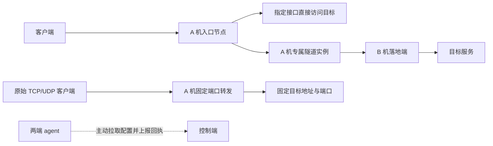
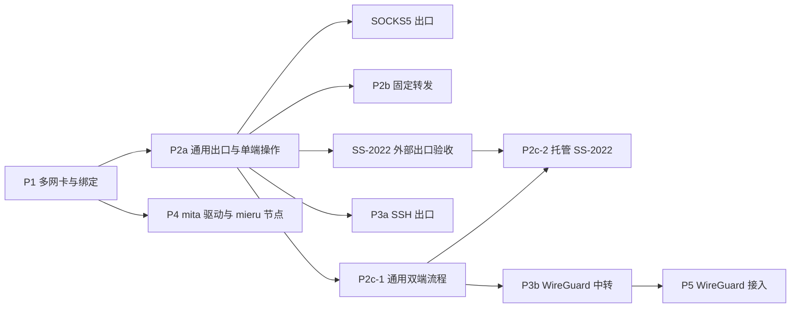

# 1. 多网卡、服务器中转与协议扩展设计方案

本文为设计方案，不能作为已交付清单。当前操作见 [网络使用指南](network.md)，实现与限制见 [实施记录](network-implementation.md)，版本汇总见 [v0.1.5 待发布说明](releases/v0.1.5.md)。

### 1.1 状态与依据

本文是针对 issue #17 截图需求及后续讨论的实现设计，基于 2026-09-20 本地代码和上游资料；不是已经实现的功能清单。实施进度与验证结果见 [实施记录](network-implementation.md)。未连接实际 VPS。开始实施前工作区已有的其他业务代码改动不属于本方案。

用户已确认同时覆盖客户端节点和 VPS 间中转，优先多网卡和 VPS 中转。本方案将建议增加的 SOCKS5 出口、SS-2022 出口及 TCP/UDP 定向转发纳入设计。优化后的交付顺序为：多网卡 → 通用出口与基础转发 → SSH/WireGuard 中转 → mieru → 客户端 WireGuard 接入。各阶段可以单独发布，完整范围见第 13 节；托管 SS-2022 的开放取决于独立验收，不阻塞通用双端流程或 WireGuard。

这里的“专线”表示使用用户已有的网络、私网接口或隧道连接。软件不会创建运营商专线，也不承诺带宽、时延或网络可达性。

### 1.2 主要决策

1. 分开管理网卡、客户端入口节点、端口转发、服务器出口配置及传输实例。客户端订阅链与服务器中转链分别建模。
2. agent 继续主动连接控制端；数据面新增监听端口不改变管理面连接方向。
3. 多网卡先支持发现、分卡统计、计费接口选择、指定监听 IP 和 sing-box 出口绑定。第一版不接管宿主机默认路由。
4. 统一出口框架依次接入 SOCKS5、SS-2022、SSH、WireGuard，复用 sing-box；每节点/转发资源独立出口对象。WireGuard 使用用户态 endpoint，其他类型使用 outbound。共享配置不等于共享一条跨资源传输连接。
5. mieru 使用上游服务端 mita，新增独立驱动，首版每节点独立实例，先实现直连部署和客户端订阅。
6. 保持服务器流量、节点流量、分享流量的现有方向定义与配额规则。新增接口视图、链路视图不能重复扣费。
7. 指定的接口或隧道失效时阻断依赖业务，不自动改为其他网卡或直连。
8. 在最小验证阶段证明计量、封禁、密钥隔离和锁定内核兼容后，才开放对应能力。
9. TCP/UDP 定向转发使用独立 PortForward 资源和 sing-box direct 入站，首版固定目标、管理员使用，不进入普通节点订阅或分享自动部署。不为基础转发新增 Realm/GOST 运行组件。
10. 后续复用同一出口框架接入 VLESS/Trojan/Hysteria2/TUIC；Tailscale、IPsec、OpenVPN、GRE、VXLAN 不纳入本轮承诺。

### 1.3 验证反馈与排期调整

能力验收按“版本 + 角色 + 方向 + 传输”记录。某版本作为 SS-2022 入站可用，不代表它作为中转客户端的 outbound 也可用；独立客户端与服务端互通通过，也不能覆盖另一客户端的失败记录。

2026-09-20 的独立实验在 sing-box 1.12.14 所用的 sing-shadowsocks2 0.2.1 中复现快速响应校验问题：请求写操作尚未返回时，有效响应可能因尚未保存请求盐值而被拒绝；AES-128 与 AES-256 均涉及。对应源码见 [锁定依赖](https://github.com/SagerNet/sing-box/blob/v1.12.14/go.mod)、[客户端实现](https://github.com/SagerNet/sing-shadowsocks2/blob/v0.2.1/shadowaead_2022/method.go)。这个证据约束新增 SS-2022 出口的开放，不能据一次成功连接把它加入已验证能力表，也不能通过重试、延迟响应或开启复用隐藏失败。详细实施证据见 [实施记录](network-implementation.md)。

因此 P2a 内部先交付通用出口与通过验证的 SOCKS5，P2b 的 direct 转发独立推进。SS-2022 外部出口和托管落地保留在完整范围内，待修复版本或受支持实现完成独立验收后开放；不因该项未通过阻塞多网卡、基础转发或 SSH/WireGuard 的独立验证。两端操作状态机按通用资源设计，WireGuard 复用它不以 SS-2022 驱动可发布为前提。产品内核仍由管理员明确选择保存，不自动升级或换实现。

2026-09-23 方向调整：只围绕官方发行版适配，撤回自编译补丁、构建和分发通道。SS-2022 出口及托管中转以官方 1.14.1 为运行基线；UDP 固定转发因官方版空闲回收验证未通过而暂不开放。当前可用范围和验证边界见 [实施记录](network-implementation.md)。

### 1.4 本次优化后的交付约定

| 要解决的问题 | 交付行为 | 验收时如何判断 |
|---|---|---|
| 一台 VPS 有公网口、私网口或多个地址 | 展示逐卡状态和用量；计费口、监听地址、出口分别选择 | 更换展示接口不改变账单；改变监听地址不暗中改变出口 |
| 客户端通过 A 机使用 B 机落地 | 入口节点绑定一个服务端出口，客户端继续使用原入口协议 | 入口地址/凭据未改时订阅等价；中转秘密不进入订阅 |
| 把入口端口送到另一台机器的固定服务 | 独立 TCP/UDP 转发资源，带来源限制、用量及启停 | 目标固定，停用后已有会话停止；不混入普通节点或分享 |
| 增加 issue 中的新协议 | 按外部出口、托管落地、客户端节点分别验收 | 同名协议一个角色通过，其他角色仍按自己的验证状态开放 |
| 旧用户升级 | 未启用新能力时保留原有路径、凭据与计费来源 | 旧版本组合、旧编辑入口、暂停/重签/删除及恢复均有回归记录 |

多网卡首版的产品含义是“识别与统计接口，并让管理员明确选择业务使用的地址和出口”。它依赖宿主机已有的地址与路由；绑定接口不负责修复缺失网关或非对称回程。自动故障切换、带宽叠加、负载均衡及宿主机多网关策略路由各自需要新的调度、计量和恢复设计，归入独立扩展。首版所选出口失效时阻断相关业务。

阅读顺序：本节看交付结果，第 3.4 节看协议选择，第 13 节看依赖与阶段，第 15 节看全链路兼容。实现和实验状态统一以实施记录为准，本文不把已写代码等同于已发布功能。

## 2. 当前实现与改造边界

下表记录开始实施时的改造基线，用于说明影响位置；后续已经进入工作树的改动和剩余缺口见实施记录。

| 现状 | 影响 | 改造位置 |
|---|---|---|
| Linux 指标优先读取默认 IPv4 路由网卡，排除部分虚拟接口 | 多网卡与纯 IPv6 场景缺少完整视图 | `internal/agent/metrics_linux.go` |
| 心跳只有单个 `Interface` 和一组 NetRx/NetTx | 无法稳定保存逐网卡历史 | `internal/agentproto/proto.go`、`internal/traffic` |
| 节点存储区分客户端 Params 和服务端 ServerParams | 可保持客户端与中转凭据隔离 | `internal/domain/models.go`、`internal/store/nodes.go` |
| sing-box 入站固定监听 `::`，每节点出站为带 mark 的 direct | 有出口扩展位置，需要维持连接归属 | `internal/core/singbox.go` |
| 同机监听端口在校验、计量中全局唯一 | 不能仅在表单开放“不同 IP 复用端口” | `internal/agentproto/validate.go`、`internal/nft/nodes.go` |
| sing-box 按权限类别共享进程，Snell 按节点实例运行 | 新驱动和新出口都需适配隔离、预算及重启范围 | `internal/core/isolation.go`、`internal/core/snell.go` |
| sing-box 使用 nft 节点标记，Snell 使用 slice IPAccounting | 隧道共享连接、回环桥接会改变计量边界 | `internal/nft`、`internal/agent/retirement.go` |
| nft 已检测计量 mark 与策略路由冲突 | 不能把现有 mark 同时当出口路由 mark 使用 | `internal/nft/nodes.go` |
| 内核、安装器、代理执行器均有组件白名单 | 新增 mita 不只增加下载链接 | `internal/core/install.go`、`internal/core/worker.go`、`internal/secureupdate` |
| 导入参数采用白名单，订阅按客户端渲染 | 新协议必须贯通解析、校验、过滤及输出 | `internal/proxynode`、`internal/subscription` |

现有账务基线、结算 ACK、删除后账务身份保留继续沿用，详见 [共享代理与计量说明](shared-proxy-accounting.md)。新增安全规则以当前代码为准，不照搬历史文档中已变更的安装流程。

## 3. 功能模型与使用方式

### 3.1 对象与职责

| 对象 | 职责 | 是否进入客户端订阅 |
|---|---|---|
| NetworkInterface | 一台机器实际存在的接口及观测状态 | 否 |
| Node | 客户端连接的入口、凭据与分享归属 | 是，按目标客户端能力输出 |
| PortForward | 固定本机端口到固定目标地址/端口的 TCP/UDP 转发 | 否，首版管理员使用 |
| EgressProfile | 直连绑定、SOCKS5、SS-2022、SSH、WireGuard 等可复用出口配置 | 否 |
| EgressBinding / TransportInstance | 某节点或转发使用某出口的实际连接资源及单端/双端状态 | 否 |

节点的“订阅地址”与“监听 IP”独立：前者可为域名或 NAT 公网地址，后者必须为该 VPS 实际可监听地址。公网地址不能靠网卡私网地址自动推断。

### 3.2 典型路径

四种主要操作：

1. 双网卡 VPS：在网卡列表看到公网口和私网口；节点选择监听 IP，再选择可到达目标的出口接口。
2. 代理中转：客户端继续使用现有 VLESS、SS 等协议；入口节点选择 SOCKS5、SS-2022、SSH 或 WireGuard 出口，客户端无需掌握中转密钥。
3. 固定端口转发：将 A 机一个端口收到的 TCP/UDP 原始数据送到 B 机固定服务端口；服务原有认证和加密由终点负责。
4. 新协议节点：直接部署 mieru，或在后续阶段创建 WireGuard 客户端接入服务；生成该客户端能够识别的配置。

第一版中转链限定为“入口或转发 → 一个出口”。若落地为托管服务器，落地服务使用直连；拒绝自引用和循环，不提供任意多跳图。外部目标的后续拓扑无法全部观测，但仍须检测本机监听目标、已知托管资源依赖及 DNS 解析后形成的明显回环。

### 3.3 本轮路线图与扩展边界

| 功能 | 设计支持范围 |
|---|---|
| 网卡监控与计费选择 | 所有接入服务器；区分接口类别与统计缺失 |
| 监听 IP | sing-box、Snell；mita 使用经过验证的版本 |
| 指定出口接口/源 IP | 首先支持 sing-box；其他驱动按能力表显示 |
| SOCKS5 出口 | 对接已有 SOCKS5 服务，TCP 必测；UDP 经独立验证才开放，不自动部署公网 SOCKS5 入口 |
| SS-2022 出口 | 外部落地及两台托管 VPS 的独立凭据中转，首版使用已验证 AES 方法 |
| TCP/UDP 定向转发 | 固定监听/目标、来源限制、独立用量和启停；可使用已验证的出口组合 |
| SSH | 现有 SSH 服务作为 TCP 出口；导入 SSH 客户端节点 |
| WireGuard | 用户态节点出口、两台托管 VPS 的成对中转、单用户接入与配置导出 |
| mieru | 手动录入/导入、mita 自动部署、mihomo 输出 |
| VLESS/Trojan/Hysteria2/TUIC 服务器出口 | 作为同框架的后续适配项，不是新增客户端入口协议 |
| Snell 经隧道出站、mita 经隧道出站 | 属于后续跨内核扩展，不能展示为已支持 |
| 宿主机整机 VPN、任意子网互通、SSH 反向隧道 | 独立扩展阶段，不混入第一版节点中转 |

### 3.4 协议选择与优先级

| 能力 | 纳入原因与使用方式 | 实施优先级与限制 |
|---|---|---|
| direct 固定转发 | A 机端口转给 B 机已有服务；直接使用已有网络 | 与通用出口基础一起优先交付；转发自身不新增认证或加密 |
| SOCKS5 出口 | 对接已有代理上游，先证明统一出口、独立计量及故障处理 | P2a 优先；TCP/UDP 分别验证，不自动部署公网 SOCKS5 |
| SS-2022 出口/落地 | 复用现有 Shadowsocks 部署能力提供加密中转 | 使用官方 1.14.1 或兼容 1.14.x；需管理员显式选中并保存版本 |
| SSH 出口 | 使用已有 SSH 服务提供 TCP 中转 | P3a；必须核对主机密钥，使用独立转发身份 |
| WireGuard 中转 | 外部 Peer 出口或两台托管 VPS 的加密中转 | P3b；复用通用双端流程，先做节点流量再做客户端接入 |
| mieru 节点 | 满足 issue 的客户端协议与服务端部署需求 | P4；独立 mita 驱动，先完成直连节点与 mihomo 输出 |
| VLESS/Trojan/Hysteria2/TUIC 出口 | 对接用户已有的其他上游 | 后续逐个适配；不延迟上述核心交付 |

SOCKS5 与固定转发是新增的基础能力，WireGuard 是托管加密中转的重点。是否适合某条实际线路，仍取决于 TCP/UDP 可达性、MTU、已有上游和实测表现；协议名称不作为“更快”或“更稳”的保证。当前上游提供 [SOCKS outbound](https://sing-box.sagernet.org/configuration/outbound/socks/)、[direct inbound](https://sing-box.sagernet.org/configuration/inbound/direct/)、[SSH outbound](https://sing-box.sagernet.org/configuration/outbound/ssh/) 和 [WireGuard endpoint](https://sing-box.sagernet.org/configuration/endpoint/wireguard/) 接口，具体可用范围以锁定版本测试为准。

## 4. 多网卡发现、选择与统计

### 4.1 接口信息

新增 Linux 网络采集模块，以 netlink 获取接口、地址及路由，以内核计数器获取字节数。采集失败返回明确状态，不能用零值代表成功。

每个接口上报：agent 分配的稳定 ID、名称、ifindex、类型、上下级关系、MAC（存在时）、地址与前缀、UP/LOWER_UP、MTU、IPv4/IPv6 默认路由信息、RX/TX、速率、采样时间和计数代次。

稳定 ID 在 agent 本地持久化，不能单独使用名称、ifindex 或 MAC。重启后结合类型、设备身份与拓扑匹配；不能唯一匹配时生成新 ID、保留旧接口历史并提示重新选择。接口删除重建或计数回退产生新代次，不将旧累计值继承给新设备。

回环、物理/虚拟以太网、bond、bridge、VLAN、WireGuard、TUN、veth 都可以展示。默认隐藏噪声接口，但不按 `wg`、`tun` 名称前缀删除观测数据。云 VPS 的 virtio 网卡仍可能是实际计费出口。

清单有数量与字节上限；超限返回 `inventory_incomplete`，已选计费接口优先采集。未完整采集时不允许新增基于残缺清单的计费选择。

### 4.2 计费接口与展示接口

服务器新增 `billing_interfaces`，可选择一张或多张，配额始终计算所选接口的 RX 增量 + TX 增量。

- 展示接口可以任意切换；计费接口变更需要预览生效时间和受影响接口。
- 拒绝明显重复的选择，例如 bond 与它的 slave、bridge 与成员、VLAN 与承载它的父接口。默认不将隧道接口与其承载接口一起用于同一份账务。
- 对无法判断是否重复的复杂拓扑显示“无法自动判断”，要求明确选择一个计量层；不提供盲目“所有接口求和”的默认项。
- 纯 IPv6 和多默认路由使用独立发现逻辑。默认路由只作为建议，不能证明该接口是运营商计费边界。
- 已选接口消失时显示服务器计量不完整；不自动将另一张接口接替进去。已知增量仍可入账，缺口明确记录。服务器接口统计失效与节点计量失效分别处理，节点计数仍健康时不因此误停全部分享；依赖该接口的出口失败或对应节点计量失效时才阻断受影响业务。

迁移时保留原单接口统计方式，先影子采集新接口计数。旧模式确实是单接口且能可靠匹配时，结算旧来源后切到该接口；旧模式曾汇总多个接口或无法匹配时，保持旧来源，等待管理员选择。两种来源不能同时计入服务器总量。

### 4.3 增量与切换

接口基线键包含 `server_id + interface_id + boot_id + counter_generation`。同代次严格按采样序列去重、处理乱序；首次看到历史累计值仅建立基线，不一次性扣掉机器启动以来的全部流量。

计费集合变更由 agent 在同一次采样边界切换：先将旧集合最后增量写入持久化待结算批次，再开始新集合。批次带 policy revision、计数来源与固定 ID；控制端在单事务中更新计费基线、服务器账务、当前策略和回执；完成配额检查后 ACK。逐接口观察历史独立维护，其失败不回退计费来源。ACK 丢失重发同批次，不能重复入账。

重启和不可恢复计数丢失不补造流量。旧账期迟到数据仍进入旧账期，不能扣新账期配额。接口图表沿用现有历史保留策略，并为额外接口样本设置总量上限。

## 5. 节点网络配置与出口配置

### 5.1 节点字段

新增结构化 `NodeNetwork`，作为独立服务端字段保存，不混进客户端 Params：

| 字段 | 含义 |
|---|---|
| `listen_mode` | `all` 或 `address` |
| `listen_address` | 实际监听的本机 IPv4/IPv6 |
| `listen_interface_id` | 地址所属接口，防止地址被误绑定到另一设备 |
| `advertise_mode` | `inherit` 或 `override`，决定节点访问地址是否随服务器公网地址更新 |
| `egress_profile_id` | 空值表示保持现有系统直连 |
| `egress_revision` | 绑定的不可变配置版本 |
| `on_unavailable` | 首版固定为 `block` |

客户端访问地址继续使用现有 `Server/Port`。自动部署默认沿用当前端口分配，同机数字端口继续唯一，包括新增内部中转端口；第一版不支持不同 IP 复用同一个端口，也不开放端口范围。

通配监听需明确 IPv4、IPv6 双栈行为，检查内核 `v6only` 差异。指定 IP 未存在、接口未就绪或 IPv4Only 与所选地址冲突时拒绝应用，而不是扩大到通配监听。发现地址不等于地址可绑定：IPv6 tentative、DAD failed、optimistic、deprecated，以及有效或首选生存期归零的地址不可用于新绑定。接口清单保留这些地址供观察，另报可用地址子集；旧 agent 未报告可用性时不能据此开放绑定。

### 5.2 出口类型

`EgressProfile` 归属于入口服务器，包含名称、类型、版本、启用状态、结构化非敏感配置、加密凭据引用及健康策略。基础阶段类型为 `direct`、`socks5`、`shadowsocks`（仅开放 SS-2022），后续增加 `ssh`、`wireguard`。扩展类型分别注册配置校验、编译、健康检查和能力，不在各页面重复维护协议分支。

直连配置包含可选接口 ID、IPv4/IPv6 源 IP 和地址族策略。接口绑定控制发起的目标连接；监听 IP 不自动决定出口。

源地址以 `{interface_id, address}` 保存，即使没有指定出口接口，也要固定地址所属的接口身份。仅绑定源 IP 不等于指定实际出口，仍按宿主已有路由发送；不能在编译时悄悄改成接口绑定。地址转移到其他接口、同名接口被删除重建或地址在多个接口上重复时，原绑定需要重新核验。应用前使用 agent 刚采集的本机完整快照，不用控制端缓存的接口名称或 ifindex 执行绑定。

sing-box 将直连配置映射到已验证版本支持的 `bind_interface`、`inet4_bind_address`、`inet6_bind_address`，保留节点自身计量 mark。上游提供这些能力，但绑定不能代替路由配置。[sing-box Dial Fields](https://sing-box.sagernet.org/configuration/shared/dial/)

应用前检查经指定接口的路由、源地址有效性及 IPv6 支持。第一版要求宿主机已有可用路由；缺失时报告具体原因，不修改默认网关、全局 DNS、`rp_filter` 或网络管理器配置。

### 5.3 路由与 DNS

- 每节点/转发入口指向自己的出口 tag，保留账务身份与配额标记。SOCKS5 UDP association、SS 会话、SSH transport、WireGuard 加密会话及连接池均不能跨账务主体合并。
- 业务 DNS 与隧道端点启动解析分别配置。业务 DNS 随业务出口；启动解析只解析所登记的隧道主机，避免“建隧道必须先通过该隧道解析”的循环。
- 指定 IPv4/IPv6 策略与隧道能力一致；没有 IPv6 出口时阻断该类请求，不偷偷从宿主机 IPv6 直连。
- 共享且无法唯一归属的启动 DNS 只计入服务器；专属于节点的握手、保活、重试流量随节点计量。
- 新配置失败可保留原已应用配置，但页面必须显示仍运行哪个 revision；已撤销凭据、配额封禁和更严格本机策略不得被回退覆盖。

直连出口首版显式选择 UDP/TCP DNS 的字面量服务器 IP 和端口，DNS socket 使用与业务相同的接口、源地址和节点 mark；不隐式调用系统 resolver，也不通过依赖自身解析的 outbound 建立 DNS 连接。UDP DNS 截断后的 TCP 重试同样遵循绑定。每个节点使用独立 DNS tag 与缓存，避免共享缓存让不同出口得到错误的分流结果。已验证的上游 DNS 传输支持 Dial Fields，最终以锁定版本实验为准。[sing-box UDP DNS](https://sing-box.sagernet.org/configuration/dns/server/udp/)

地址族限制同时作用于 DNS、字面量目标和业务连接：`ipv4`、`ipv6`、`dual` 为显式策略，仅改变解析优先级不能阻止客户端直接请求另一地址族。服务器 IPv4Only 收紧节点的 dual 策略；与显式 IPv6 源地址、监听地址或 DNS 传输冲突时拒绝应用。

### 5.4 SOCKS5 出口

配置为上游地址、端口、认证方式、加密存储的用户名/密码、地址族、超时、外层接口绑定及 UDP 开关。仅启用版本 5，使用 sing-box SOCKS outbound；基础 SOCKS5 不提供传输加密，页面如实标注，适用于已有可信网络或用户明确选用的上游。[SOCKS outbound](https://sing-box.sagernet.org/configuration/outbound/socks/)

结构化配置把业务的 `family` / `dns` 与 `outer` 分开：后者复用直连绑定结构，其中 DNS 仅用于启动解析上游。IPv6 目标可以通过 IPv4 SOCKS 上游访问，不能将外层地址族误用成业务地址族。连接超时为 1–60 秒；仅 TCP 出口要求 TCP 业务 DNS。用户名/密码不放进公开配置 JSON，独立加密保存并绑定服务器、出口和不可变版本。更新时省略凭据表示继承当前版本；改为无认证只影响新版本，旧引用仍使用原凭据。若从无认证重新切回密码认证，必须明确提供新凭据，不能猜用更早版本。

首版连接既有上游，不自动创建开放代理。TCP 与 UDP 独立协商能力：TCP CONNECT 成功不能证明 UDP 可用；UDP 必须验证 UDP ASSOCIATE、控制连接存活、双向收发、NAT 和中继地址。未经验证或被禁用时拒绝 UDP，不回退直连，也不静默套用 UDP-over-TCP 扩展。

每个账务主体独立建立连接及 association，并为控制/数据 socket 设置同一主体的归属。动态中继地址只能落在已验证的上游范围和本机窄权限内，不能因为服务器返回 BND.ADDR 就开放任意内网。零地址等合法响应要按协议规范和连接对端规范化后再次校验；规范化规则纳入测试。

### 5.5 SS-2022 出口与托管落地

使用 sing-box Shadowsocks outbound，VpsCT 基础版本仅开放通过测试的 `2022-blake3-aes-128-gcm`、`2022-blake3-aes-256-gcm`，分别校验解码后的 16/32 字节密钥；不把任意插件、复用选项或整份外部配置直接透传。[Shadowsocks outbound](https://sing-box.sagernet.org/configuration/outbound/shadowsocks/)

支持两种配置来源：

1. 外部落地：管理员录入地址、端口、方法、密钥；或从有权限读取的已存在节点复制允许字段形成独立版本。原节点后续变化不静默覆盖该版本，显式刷新时展示差异。
2. 托管落地：选择另一台已接入服务器，系统为每个 binding 生成独立 SS-2022 服务、端口及密钥，复用现有部署编译器，资源角色为 transit，不创建普通分享节点，也不公开到“全部节点”订阅。

托管落地先准备接收端，再验证发送端并启用入口，复用第 7.3 节的幂等操作流程。密钥由控制端产生并持久化，重试不重新生成；轮换只作用于对应 binding。TCP/UDP 分别验证，禁用跨主体 multiplexing；同一进程可包含多个独立入站/出站。

外部落地若实际复用了某个已有节点，它在另一套账本中的收费由该节点所属系统决定；VpsCT 不自动将它视为免费 transit。托管中转只使用专属 transit 资源，避免两端同时扣同一份分享额度。

### 5.6 TCP/UDP 定向转发

新增 `PortForward`，与代理节点分开管理。字段包括服务器、名称、监听地址/端口、`tcp|udp|both`、固定目标主机/端口、来源 CIDR 集合、可选出口及 revision、启用状态、UDP 空闲超时和有界连接/会话预算。

使用 sing-box direct 入站覆盖目标地址和端口，再路由到所选独立出口；不新增转发二进制，也不使用宿主机 DNAT/FORWARD 链。上游 direct 入站具备 TCP/UDP 监听和固定目标能力，具体配置编译须适配锁定版本。[Direct inbound](https://sing-box.sagernet.org/configuration/inbound/direct/)

- 同一个转发只能指向一个确定目标；动态解析只更新该主机的合规地址，不接受客户端指定任意目标。
- 监听端口参与全机统一预留，与节点及 transit 服务冲突检查；`both` 占同一个数字端口的两种传输，不能拆给其他资源。
- 来源集合为空时不开放入口；允许任意来源是显式值，不由空值推断。ACL 在接入侧执行，更新后也要阻断不再允许的已有会话；固定私网目标另需本机精确授权，不能全局放开私网。
- 转发本身不提供用户认证、不终止业务 TLS，也不承诺保留客户端源 IP；不自动插入 PROXY protocol。业务协议、SNI、证书验证和认证保持由客户端与最终服务处理。
- 首版管理员使用，有独立用量、状态和启停；不加入分享自动部署、不生成伪造的代理 URI，也不自动改写现有订阅端点。通过转发使用落地节点时，客户端须明确采用入口地址并保留终点的协议参数。
- 目标/出口改变时关闭旧 TCP/UDP 会话后启用新版本，不能让旧目的地址无限存活；失败时显示运行中的 revision。UDP 无响应仅代表未知，不能与 TCP 可连接混为一个“健康”状态。

每个转发使用独立 `forward` 账务身份，统计入口和其出口真实收发，不按目标节点归属猜测。属于纯管理员转发的流量不额外扣任何分享配额；最终服务若自己计费，保持它自己的语义。

### 5.7 可组合能力与边界

| 组合 | 第一阶段行为 |
|---|---|
| sing-box 节点 → direct/SOCKS5/SS-2022 | 基础出口范围；TCP/UDP 各自通过验证才支持 |
| PortForward → direct | 基础转发范围，优先验收 |
| PortForward → SOCKS5/SS-2022 | 随组合测试开放，UDP 必须逐跳均支持 |
| sing-box 节点或 PortForward → SSH | SSH 阶段开放 TCP；拒绝将 UDP/both 转发绑定到 TCP-only 出口 |
| sing-box 节点或 PortForward → WireGuard | WireGuard 阶段逐组合验收 |
| Snell/mita → 新增出口 | 继续作为跨内核后续扩展，不因 UI 有选项就宣称可用 |

能力由入口类型、出口类型、TCP/UDP、内核版本、计量方式、本机策略共同决定。节点若只提供 TCP 业务可显式选择 TCP-only 出口；需要 UDP 的业务和 UDP-based 上游握手不可静默降级。实际接入数量受实例、端口、内存、会话和计量 ID 预算限制。

### 5.8 共用实现与扩展规则

采用统一 `EgressBinding` 关联消费资源（node 或 forward）、不可变出口版本及资源 generation；`TransportInstance` 记录本机和可选落地端的实际资源。所有出口类型共用此绑定与实例模型。

节点、transit 入站和 PortForward 各自校验后编译为内部受管监听资源，复用端口预留、出口编译、计量、guard 和应用事务；普通节点的 API、客户端协议及原有账务 ID 保持兼容。外部出口不虚构一个可管理的远端实例，也不依赖另一台 agent 的回执。

后续的 VLESS/Trojan/Hysteria2/TUIC 出口只增加适配器和对应验证，不重建资源模型。它们没有被纳入基础版本的默认承诺。HTTP CONNECT、Tailscale 或其他组网协议同样经过独立评审后进入能力表，不因上游目录列出就自动开放。

## 6. SSH 出口与客户端节点

### 6.1 首版路径

现有代理入站 → 该节点独立 SSH outbound → 用户指定的 SSH 服务 → TCP 目标。sing-box 已提供 SSH outbound 及主机公钥字段；上游在该字段为空时接受任意主机密钥，因此 VpsCT 必须显式要求可信公钥。[SSH outbound](https://sing-box.sagernet.org/configuration/outbound/ssh/)

配置包括远端主机、端口、显式用户名、认证方式、凭据、主机公钥、连接超时和可选本机出口绑定。优先密钥认证，也可支持密码；不读取 agent 的个人 SSH 配置、不接受任意私钥文件路径、`ProxyCommand` 或 shell 片段。

主机公钥须由管理员提供或通过独立可信渠道核对。网络探测获得的指纹仅为候选，不能自动信任。主机密钥变化时停止新连接并报告。

### 6.2 UDP、权限与计量

首版 SSH 仅承诺 TCP 转发，能力表返回 `udp=false`。入口协议是否使用 UDP 传输，与业务流量是否支持 UDP 是两件事；例如入口可建立并不代表 UDP 应用能通过 SSH。

每节点独立 SSH 连接，出站 socket 必须带该节点计量标记。若锁定版本不能做到，改为该节点专属代理实例与单一 cgroup 计量；验证通过之前禁用此组合，不能通过平均分摊解决。

既有私网目的地址限制要在转发前执行；域名解析结果也必须校验，避免远端解析绕过限制。托管落地端还执行自己的出口限制；外部 SSH 服务的远端系统行为由其管理员控制，面板不得声称已验证远端隔离。

首版不修改远端管理 sshd、不复用管理 root 凭据。远端需有专用转发账户及所需权限；普通 SSH 转发控制可参考 [OpenSSH 配置](https://man.openbsd.org/sshd_config)。

### 6.3 客户端输出与后续托管服务

导入 SSH 节点仅保存并渲染客户端连接所需字段，支持经过验证的 mihomo/sing-box 格式。服务器出口凭据永远不因开启订阅而暴露。

自动部署 SSH 入口作为单独扩展：使用独立 sshd 配置、端口、主机密钥、专用账户，禁止 shell、PTY、agent/X11 转发和远程转发，仅允许所选 TCP 转发功能。不编辑管理 sshd。授权和出口封禁需要以实际 OpenSSH 版本做集成测试后开放。

## 7. WireGuard 设计

### 7.1 选择用户态 endpoint

初期使用 sing-box `wireguard` endpoint 的用户态模式，不创建宿主机 `wg0`，不修改宿主机全局路由或开启整机 IP forwarding。endpoint 自 1.11.0 起提供，项目当前默认版本为 1.12.14，但实际发行构建与所有所需字段仍需验证。[WireGuard endpoint](https://sing-box.sagernet.org/configuration/endpoint/wireguard/)

配置包括本端密钥、隧道地址、远端公钥、可选 PSK、远端端点、AllowedIPs、MTU、保活、外层出口绑定及角色。所有地址段由管理员明确选择或从配置的地址池分配，禁止把个人网络段写成产品默认值。

### 7.2 外部出口与成对中转

**外部 WireGuard 出口：** 一份本端私钥/Peer 身份首版只能绑定一个节点。不能把同一身份复制到多个 endpoint，否则远端可能在不同连接间漂移。已有 WireGuard 服务要供多个节点使用，应为每个节点增加独立 Peer。

**两台托管 VPS：** 一个可复用落地配置可以为多个节点生成独立 binding。每个 binding 拥有独立两端密钥、隧道地址、接收端 UDP 端口和运行状态。可以共用同一 sing-box 进程，但不共用跨节点加密 socket。

独立端口和 Peer 是首版准确识别流量、封禁单节点的选择。未来共享监听端口必须先证明按 Peer 的计量与撤销能力，不能直接去掉这些约束。

### 7.3 两端协作与生命周期

控制端保存持久化操作记录，包含 operation ID、binding generation、两端目标 revision、阶段、超时、最后错误及清理状态。该流程共用于托管 SS-2022 和 WireGuard；外部出口仅执行本端准备、验证与启用，不等待不存在的接收端 agent：

`draft → preparing_receiver → preparing_sender → verifying → active → draining → retired`

1. 预留双方需要的端口和身份，WireGuard 额外预留隧道地址，生成对应协议凭据；离线端只保留待处理记录。
2. 先下发接收端，得到准确 revision 的监听与防火墙就绪回执。
3. 下发发送端，业务入口保持阻断；使用受限探测验证握手与必要的 TCP/UDP 路径。
4. 两端就绪后启用入口，并标记 active。接收端已监听不代表整条链路可用。
5. 删除时先阻断发送端入口与已有连接，再结算、停发送端、停接收端，最后删除凭据与资源；离线端保留清理任务。

每步都幂等。控制端重启、回执丢失或重复执行不生成第二套密钥/端口。验证插件按类型执行 SS-2022 数据交换或 WireGuard 握手及必要业务探测，不能将不同协议的健康条件混用。不能实现跨机器瞬时原子切换，UI 明确显示局部成功；失败恢复旧路径或保持阻断，不把半条新链路标为成功。

链路状态区分“配置已应用”“可用”“按需空闲”“握手过期”“异常”。不能用无业务时未握手判断故障，也不能只用握手判断最终目标可达。

### 7.4 客户端 WireGuard 接入

后续同一模型支持客户端 → 托管 WireGuard endpoint → 直连目标。首版每节点/分享一个独立 Peer 和端口；客户端私钥归客户端，服务端私钥不能进入订阅。

默认由用户提供客户端公钥；若选择由面板生成完整客户端配置，客户端私钥加密保存并通过已有受保护交付入口提供。支持原生 WireGuard `.conf` 及通过测试的 mihomo/sing-box 配置；二维码仅在管理员或该分享持有人可访问页面生成。

用户态实现首先验收 TCP/UDP 代理访问。完整三层 VPN、ICMP、任意子网互通不能据此宣称支持，归入第 13.3 节的系统 WireGuard 扩展。

### 7.5 MTU 与网络条件

MTU 由显式配置或根据承载路径的保守建议确定，并支持诊断大包失败。分别验证 IPv4/IPv6、NAT、端点域名变更、保活和 UDP 不可达。AllowedIPs 的客户端路由范围与服务端接受的 Peer 源地址分开校验，不能把允许访问全部目标解释为允许任意源地址冒用。

## 8. mieru / mita 接入

### 8.1 驱动与实例

协议名 `mieru`，驱动名 `mieru`，服务端程序为 `mita`。新增版本目录、可信下载组件、代理执行器白名单、资源预算、诊断、卸载路径及第三方声明。继续由用户在设置中选中并保存版本才升级。

首版一个 Node 对应一个 mita 实例、用户、端口及稳定 slice。支持单端口 TCP 或 UDP；不开放端口范围与多用户共用实例，避免跨用户计量和封禁问题。

每实例必须隔离配置、运行目录、控制 Unix socket 和运行用户。上游代码提供独立控制 socket 的入口，但完整多实例路径、启动及重载行为应以选定发行版本验证。[mita 实现](https://raw.githubusercontent.com/enfein/mieru/main/pkg/appctl/server.go)

安装器获取固定官方构件并校验，不直接执行上游网络安装脚本。若只提供 deb/rpm，安全提取已核验程序或通过现有发行渠道提供经过核验的构件；不执行包脚本接管宿主机全局 mita 服务。

### 8.2 配置、应用与计量

UI 最初提供用户名、密码、监听 IP、端口和传输类型，其他字段按已测能力逐步开放。mita 官方文档提供监听 IP 和 SOCKS5 出口配置；并不能由此推断它具备任意网卡绑定功能。[服务端文档](https://github.com/enfein/mieru/blob/main/docs/server-install.md)

候选配置在隔离状态目录完整验证后切换。上游配置应用包含合并语义，驱动必须生成完整期望状态并删除过期用户/字段，不能让旧密码因合并保留下来。应用失败恢复上一已验证配置；撤销操作优先封禁，不能恢复已撤销凭据。

直连实例使用持久化 slice IPAccounting，source 带独立版本，重启服务不丢弃 slice 计数；不叠加 nft 字节计数。nft/cgroup 仍负责配额封禁与私网出口限制。新驱动未具备连接级日志时明确显示不支持，不伪造空日志为成功。

### 8.3 订阅与跨内核出口

首版支持 mihomo 的 mieru 字段与经验证的客户端版本，普通 Clash 不承诺支持；官方 sing-box 不输出未经支持的 mieru 类型。上游 mihomo 文档明确列出用户名、密码、传输方式等字段。[mihomo Mieru](https://wiki.metacubex.one/config/proxies/mieru/)

mita 经 WireGuard/SSH 或指定接口的扩展可以采用每节点独立本机 SOCKS5 桥接到 sing-box；但必须额外实现仅该 mita 用户可访问的桥接端点、默认拒绝旁路直连、UDP 能力验证，以及排除内部传输的统一计量。不能把 mita IPAccounting 与桥接出口计数直接相加。此组合通过专项验证前保持禁用。

## 9. 流量、配额与隔离

### 9.1 计量口径

| 视图 | 计量来源 | 是否额外扣分享配额 |
|---|---|---|
| 服务器 | 选定计费接口的接收与发送增量 | 否，服务器自身配额使用此值 |
| 网卡 | 单接口内核计数 | 否，仅作为服务器计量来源或独立视图 |
| sing-box 节点 | 客户端连接及该节点独立出站传输的 nft 计数 | 是，沿用节点所属分享关系 |
| PortForward | 该转发入口及独立出口的 nft 计数 | 否，首版不分配给分享 |
| Snell / 直连 mita | 该节点 slice 的 IPAccounting | 是，不与 nft 再求和 |
| 托管中转的落地端 | 独立 transit 账务身份，统计该端真实网络收发 | 否，不重复扣入口分享 |
| 隧道视图 | 已存在计数的投影或诊断读数 | 否 |

入口服务器 A 与落地服务器 B 都实际收发字节，所以各自服务器账单都有增量。这不是同一服务器内重复计费。分享仍只使用入口所属节点的 RX+TX；若以后要按整条链路成本收费，必须是新的显式产品规则，不能静默变更。

用户态 WireGuard 在入口侧统计客户端流量和外层隧道 UDP；用户态内部明文不再计入。落地侧统计该端隧道及目标连接，明确属于另一台机器。单节点专用隧道的保活与握手属于该节点；无法唯一归属的公共探测只进入服务器用量。

### 9.2 账务身份与封禁

现有 NodeID 账务身份继续保留。中转落地端使用独立 `transit` subject 和 `meter_id`，与入口 NodeID/forward ID 有关联但不是同一账本；转发使用 `forward` subject。新增 mark 命名空间须有无冲突分配器，并同时扩展策略路由冲突检测；不得重用、覆盖现有 `0x43` 节点计量标记。规则生成器依据显式资源种类分配计量，不能把非节点资源伪装为 NodeID。

共享 nft 基础设施仍保持三个独立账务主体：node 可扣分享，forward 只进入自身视图，transit 只进入落地视图。复用编译器不意味着合并累计计数。SOCKS5 控制连接、UDP association、SS-2022 重连都必须继续归属原消费资源；内部资源不能被现有 IncludeAll 节点查询带入订阅或分享。

带新计数来源的心跳仅发给已声明支持该来源的控制端。旧数据不清空，删除绑定和节点保留无凭据结算墓碑，直到终值确认且不再有迟到计数。

配额封禁必须同时停止新连接和现有转发，包括 SOCKS5 TCP/UDP association、SS-2022 会话、SSH 长连接与 WireGuard UDP；不能只隐藏订阅或停止接受新连接。管理员停用 PortForward 也执行同样的已有会话阻断，但不由此新增分享扣费规则。延迟上报可能导致配额超量，沿用轮询性质并明确诊断，不宣传绝对零超额。

指定出口掉线、计量规则丢失或本地计量不可恢复时，关闭受影响节点并报警；仅控制端暂时离线且本地规则正常时维持已应用服务和持久化计数，不因普通轮询失败重启业务。

### 9.3 私网与凭据

传输到某个私网隧道端点的权限，与代理访问任意私网目的地址的权限分开。新增本机窄权限：按 binding 登记端点 IP/CIDR、协议和端口，仅开放传输连接；不能为建隧道把节点加入全局私网放行名单。

SOCKS5 的本机策略字段与配置步骤见 [私网中转授权](network-transport-authorization.md)，已验证范围和剩余工作以 [实施进度](network-implementation.md) 为准。

本机 root 策略继续拥有最终决定权。新增配置不能接受任意 shell、文件路径、unit 名称、nft 脚本、下载仓库或网络管理器配置。防火墙只操作 VpsCT 拥有的表、链和规则。

复用现有字段加密机制保存可恢复密钥；新增字段有独立加密标签。API 普通读取只返回 `configured`、公钥及指纹，密码/私钥采用写入或显式轮换语义，掩码不能当密码回写。配置 hash、错误、审计、探测结果均不得包含原始凭据；agent 只接收本机实际需要的秘密。

## 10. 数据结构、接口与配置协议

### 10.1 建议新增/扩展的数据

| 数据 | 核心字段与约束 |
|---|---|
| `server_network_interfaces` | server_id、interface_id、最新观测、身份匹配信息、最后见到时间；按服务器唯一 |
| `server_network_policies` | server_id、revision、计费接口集合、旧模式迁移状态、生效采样序列 |
| `nodes.network` / `node_networks` | 节点逻辑网络字段使用关联表落库，保存监听设置、egress_profile_id、绑定 revision 与编辑版本；同服务器外键约束；现有节点默认值等同当前行为 |
| `server_network_requirements` | 持久记录已启用的网络配置版本；删除最后一个绑定后仍保留，受控降级确认本机清理后才可解除 |
| `server_network_generations` | 已启用网络功能的服务器配置代次、已发布代次、发布退避与重试版本；同时作为持久化发布队列，覆盖旧节点删除等入口 |
| `port_forwards` | server_id、监听/目标、TCP/UDP、来源 ACL、出口引用、revision、会话预算及启用状态；无 share_id |
| `egress_profiles` | server_id、类型、名称、enabled、当前 revision |
| `egress_profile_revisions` | 不可变结构化公开配置与创建时间；不含凭据正文 |
| `egress_profile_credentials` | 与服务器/出口/版本绑定的独立加密凭据；不可修改，删除对应版本时级联清理 |
| `egress_bindings` | node/forward 消费资源、出口版本、目标服务器/外部端点、generation、状态；约束 WG 身份唯一占用 |
| `transport_instances` | binding、所在服务器、发送/落地角色、资源端口、身份、公钥、秘密引用、资源上限 |
| `network_operations` | operation_id、请求摘要、资源编辑版本、服务器代次、发布/应用状态、精确回执、重试版本；双端阶段与清理进度按中转阶段扩展 |
| `meter_resources` | node/forward/transit 的账务来源、标记/进程归属、generation、结算与墓碑状态 |

逐网卡历史可以复用现有小时/日聚合表，subject 新增 `interface`；给接口表分配内部整数主键供聚合引用。瞬时样本独立设置总量限制。外键、唯一索引和资源预留必须在数据库事务内生效，不能仅靠表单防重复。

### 10.2 管理 API

建议接口沿用 `/api/v1`，权限、CSRF、审计和速率限制与现有管理 API 一致：

| API | 用途 |
|---|---|
| `GET /servers/{id}/network` | 网卡、地址、路由摘要、有效计费策略、采集状态 |
| `GET /servers/{id}/network/capabilities` | 当前服务器运行条件及不能启用网络功能的原因 |
| `POST /nodes/{id}/network/preview` | 检查 network、访问地址与影响范围，返回 impact.token；预览通过不保留执行资格 |
| `PUT /nodes/{id}/network` | operation_id、expected_revision、expected_impact 和 network 必填；显式 null 申请恢复默认网络 |
| `GET/PUT /servers/{id}/network/billing` | 查询当前/待生效计费策略；带 expected_revision 申请切换接口 |
| `GET /servers/{id}/interfaces/{iid}/traffic` | 单接口历史 |
| `GET/POST /servers/{id}/egress-profiles` | 查询/创建出口配置 |
| `POST /servers/{id}/egress-profiles/preview` | 只读预览创建出口，action=create |
| `GET/PUT/DELETE /egress-profiles/{id}` | 查询、创建新版本、删除未使用配置 |
| `POST /egress-profiles/{id}/preview` | 只读预览更新或删除，action=update/delete |
| `GET /egress-profiles/{id}/revisions/{revision}` | 读取节点实际引用的不可变出口版本 |
| `POST /egress-profiles/{id}/probe` | 对已保存端点发起有界探测 |
| `GET/POST /servers/{id}/port-forwards` | 查询/创建固定 TCP/UDP 转发 |
| `GET/PUT/DELETE /port-forwards/{id}` | 查询、修改/停用、结算并退役转发 |
| `GET /port-forwards/{id}/traffic` | 转发独立用量 |
| `POST /egress-bindings` | 为指定节点或转发创建外部/托管出口绑定 |
| `GET/DELETE /egress-bindings/{id}` | 查询、异步退役绑定 |
| `GET /servers/{id}/network/operations` | 分页查询服务器网络操作 |
| `GET /network/operations/{op}` | 单机发布/应用进度，后续扩展双端与清理进度 |
| `POST /network/operations/{op}/retry` | 带 expected_retry_revision 请求新的发布尝试；返回 202 |
| 现有节点创建/更新接口 | 保留旧编辑语义；创建时如携带网络选择，复用同一准入与事务规则，不另设绕过入口 |

应用类操作返回 `202` 和包含操作编号的记录，配置保存不能直接回“已生效”。并发编辑用 revision 冲突响应；创建携带 operation_id 幂等键，完全相同的重传返回原操作，不同内容复用同一编号返回冲突。重试使用独立的 expected_retry_revision 做 CAS，重复提交不会重置两次预算，冲突后读取原操作确认结果。删除被引用出口返回依赖列表，不自动将依赖节点改成直连。端点探测不是任意 URL 请求器，目标来自已存配置，受本机权限、次数和时限控制。

出口模板编辑与运行变更分开表达：创建模板、保存新版本或删除未引用模板返回 `saved`，不等待 agent，也不改变已有节点引用。启停被引用的出口返回 `queued`，由持久队列发布并等待精确回执。停用允许离线提交，必须提示尚未收到生效回执；恢复启用重新检查全部依赖节点实际固定的版本，不能仅验证最新模板。暂停节点也保留引用和恢复约束。创建、更新、删除均需要 operation_id 和显式 expected_revision；创建版本为 0，保存时明确提交 enabled。

节点网络与出口的新写请求还须携带预览返回的 `expected_impact`。摘要绑定规范化草稿、实际继承地址和依赖/重启清单；同一写事务重新计算，不以预览替代运行条件检查。缺少预览返回 428，范围变化返回 409，且不保存部分配置。已接受的完全相同请求优先返回原操作，包括旧接口已接受但不含该字段的请求；新旧草稿不能混用同一 operation_id。

影响清单只包含管理员可见的节点名称、端口、固定出口版本、分享归属和配置状态，不输出协议凭据。当前最多 2048 个节点，超出拒绝预览，不截断后提交；界面每页显示 10 项。运行变更还合并最后完整应用以来保留的发布历史，覆盖多内核部分失败后可能已运行的入口。历史最多扫描 64 代、合计 16 MiB；缺失、清理、损坏或超过预算均标记历史不完整，并按服务器全部受管 sing-box 进程提示影响。配置证据不能证明实时运行状态，也不自动恢复旧入口。

### 10.3 Agent 协议与兼容

心跳增加有版本的 `capabilities`、`network_inventory`、`interface_counters`、`transport_status`、`forward_status`、`resource_counters`、`operation_reports`。能力必须包括所安装内核版本与实际支持组合，不能仅按 agent 版本猜测。

DesiredState 增加 `schema_version`、网络策略、出口实例、`PortForwardSpec`、transit 服务和应用阶段。NodeSpec 增加结构化网络配置；所有字段进入配置摘要，并在最终特权边界重复验证。

新增有版本的 ResourceCounter，包含资源种类/ID、meter_id、source、epoch、采样序列及 RX/TX；forward/transit 使用此通道，现有 node 继续使用兼容计数来源。终值结算同时支持新资源种类，控制端 ACK 只在基线和账本同事务提交后返回。同一资源同一代次仅允许一个有效计数来源，拒绝 node 与 resource_counters 重复上报同一主体。旧控制端未声明支持时，agent 不运行需新账务的新转发/中转功能。

原 NetRx/NetTx 字段在兼容期继续发送，但新控制端一旦选择新计量来源就忽略旧汇总；新 agent 遇到旧控制端只启用旧功能。控制端不得把新网络配置下发给不能理解它的旧 agent。已有旧 schema 的 hash 计算必须维持原字节语义，不能通过无条件新增非空字段让所有旧配置摘要失配。

新能力需要“控制端认识 + agent 支持 + 内核支持 + 本机策略允许 + 计量可用”全部满足。升级 agent 或调整内核版本保持现有显式流程；选中新功能不能暗中追最新内核。

绑定阶段使用可选 `network_binding_version`，未启用时不改变旧格式和摘要。启用后，控制端和 agent 都持久记录版本要求；后续无节点的清理配置也必须保留要求。每次获取 desired 时声明能力，控制端在返回正文或 304 前校验，不仅依赖以前保存的心跳。配置版本与正文须原子提交，并比较构建前的最新 revision；并发新发布完成后，旧构建重新读取配置，不得覆盖新意图。

绑定阶段还携带可选 `network_generation`，覆盖“新配置已保存、但尚未发布”的并发窗口。节点网络、部署节点的凭据/启停/删除、分享状态、服务器运行设置和相关核心设置，在保存事务内使代次递增；发布时同时核对代次和构建前的 desired revision。观测数据和流量累计不递增代次，未启用网络功能的旧服务器继续省略字段。配置代次是并发与恢复边界，不是健康证明。

### 10.4 能力检查与真正生效的区别

能力记录按“功能角色、入口/出口协议、方法、TCP/UDP、架构、内核版本与构件、计量方式”确定。原生构建通过不代表该架构的真实网络测试通过；上游最新版有字段不代表项目锁定版本可用。配置适配器只输出目标版本支持的字段，例如 WireGuard `on_demand` 在上游文档标注为 1.15.0 新增，不能直接写入 1.12.14 配置。[版本字段说明](https://sing-box.sagernet.org/configuration/endpoint/wireguard/)

互操作验收同时记录测试客户端版本和首包方向。除客户端先发外，包含服务端先发、TCP/UDP、域名与字面量目标；测试客户端自身不符合协议时单独定位，不能放宽生产校验或用自动重试掩盖。已发现的 sing-box outbound 请求盐时序问题，以及独立 shadowsocks-rust 空载荷零填充问题分别保留复现证据，不能互相替代或用一次成功推定全部通过。

检查分为三个时点：

1. **预览：** 读取服务器当前诊断与接口清单，列出缺少的条件、影响节点和可能的服务重启。控制端以收到观测的时间判断是否过期，不修改 agent 的采样时间；在线不等于清单新鲜。
2. **接受变更：** 保存事务内再次检查能力、维护状态、资源归属、不可变出口版本和编辑版本。预览结果不能作为通行令牌。旧页面省略 network 不删除已存配置；专用网络写接口省略 network 则报错。
3. **本机应用：** agent 获取刚采集的本机状态，复查 root 策略、地址归属、接口、计量及保护规则。应用完成只表示匹配版本的配置已执行；链路可用仍需对应 TCP/UDP 验证。

显式恢复默认网络是有影响的变更：预览说明将撤销哪些绑定、恢复什么路径，仍等待兼容 agent 完成清理。原接口已消失不应使清空操作永远无法执行，也不能把清空数据库记录当成清理完成。完全相同的已接受请求重传只返回原操作，不再次创建或恢复旧绑定。

接口与页面区分“实现尚未通过验证”“版本不支持”“当前条件不满足”。能力不足时说明可操作的原因；隐藏菜单或前端禁用不能代替服务端校验。协议、架构等发布能力表仍须补齐，不能把当前临时开放的 SS-2022 AES-128 入站组合当成整个 P1b 的验收范围。

## 11. 应用事务、健康检查与回退

### 11.1 配置发布与本机应用

控制端先在同一事务中保存配置、操作和审计，由持久化队列负责发布。发布事务同时写入完整 desired、已发布代次和操作的回执标识；启动时和定期扫描未发布代次，覆盖没有新网络表单的旧删除入口。发布失败自动退避，单轮最多 8 次；手动重试持久化新的重试版本并生成新的 desired revision，旧 worker 结果不消耗新预算。只有服务器、desired revision、摘要和当前代次均匹配的回执才将操作标为已应用；“已发布”“agent 在线”或“版本更大”均不能代替成功回执。

单机应用分为：校验 → 预留资源 → 生成候选 → 内核检查 → 安装限制规则 → 切换服务 → 检查 → 提交状态。不存在跨文件、systemd 和 nft 的统一事务，因此每阶段写入持久化操作记录，并记录可恢复的旧配置与资源清单。

新入口在防火墙、计量和权限未就绪前保持阻断；旧入口只有在仍满足当前配额、凭据与本机权限时才能在候选失败后继续使用。先执行封禁、撤销和更严格权限，再进行网络预检；缺卡不能阻止其他节点的更新。改变凭据或绑定的候选使用不可续期的待应用状态，内核配置回滚不能恢复旧租期。相关内核成功应用后才激活该内核的候选。当前 sing-box 应用流程在任一候选分组变化时会停止全部活动分组并重启候选，因此预览按该服务器全部受管 sing-box 权限组列出可能影响，不只列被编辑节点所属组，也不承诺无损热更新。

失败时只撤销本次创建的资源。若原配置仍满足当前配额、凭据和本机策略，可恢复旧配置；否则保持相关服务停止。计数来源发生切换时先完成结算，不把旧累计值再记一次。

重试采用退避、有上限并带抖动；配置不变不反复重启。端口被其他进程占用时拒绝应用，不停止未知进程。接口丢失时本地监测和 guard 阻断出口，接口恢复后仅在原绑定身份、地址、策略仍匹配时恢复。

节点网络保护使用独立的 `inet ctlvps_network` 表，优先于通用出站/DNS 放行及计量规则。每个绑定有最长 6 秒的内核放行租期，独立本机监测每秒续期，只接受刚采集的本机状态；事件丢失、采样失败或进程停止不能无限保留旧健康结果。链路/地址事件先撤销相关绑定的放行，再采样核验；已有连接也受入口、socket/连接标记及接口/源地址规则约束。事件处理是异步的，租期提供未续期时的明确停止边界，不承诺零时延故障切换。[nftables 元素过期](https://wiki.nftables.org/wiki-nftables/index.php/Element_timeouts)

每次应用分配新令牌，旧监测任务不得续期或撤销新应用；同令牌重试须校验相同内容。guard 的根权限策略先记录应用意图，再安装规则；watchdog 恢复规则时使用空放行集合，不能恢复过期健康状态。防火墙完整性检查与动态租期分别验证。卸载 agent 时，在代理服务全部停止后删除自有网络保护表；只卸载控制端时保留 agent 的保护。

规则安装失败时停止相关受管内核，可能影响共享进程的其他节点；不要在缺少保护时继续启动候选。涉及新绑定的旧计量迁移失败后，不恢复未携带新计量 mark 的旧进程。网络配置的已接受最高代次与全量应用结果分开持久化，防止部分失败后旧配置重放恢复被撤销的凭据；主动回退必须生成新的 desired 代次。

删除、卸载和恢复都包含新 unit、slice、受限状态目录、计量规则及未完成操作。只清理 VpsCT 自有资源；不删除用户现有 wg 接口、路由、管理 sshd 或其他代理服务。

### 11.2 维护与配置变更互斥

控制端和 agent 各自执行互斥，分别保护持久意图与本机实际执行。维护开始后，已有发布意图保留在队列，暂停该服务器的新网络发布和拉取；等待维护不消耗发布失败预算。维护结束后重新核对代次与能力，继续最新意图，不按旧预览直接应用。

本机配置执行与 agent 升级/卸载使用同一目标锁。维护准入先获得锁再记录持久任务，实际 worker 执行期间也持有锁；配置应用既检查持久维护状态，也获取同一执行锁。这样进程重启或遗留任务状态不会允许同时修改代理文件和程序。只维护控制端时不无故占用 agent 的配置目标。

配置等待锁期间，独立计量、现有保护监测和租期检查继续工作；不能为了等待维护暂停失效检测。异步内核安装、启动恢复和维护恢复也须审计其锁边界。单元测试验证互斥逻辑后，还需在实际安装器生成的 systemd 权限下验证升级、卸载、配置等待与恢复，再宣称完整覆盖维护冲突。

## 12. 页面与订阅行为

### 12.1 页面变化

| 位置 | 展示与操作 |
|---|---|
| 服务器详情 → 网络 | 网卡列表、地址、状态、类型、速率、流量；单独标明计费接口 |
| 服务器详情 → 出口与隧道 | 新增直连/SOCKS5/SS-2022/SSH/WireGuard、被哪些资源使用、单端/两端状态、诊断与退役 |
| 服务器详情 → 端口转发 | 固定目标、TCP/UDP、来源范围、出口、独立流量和启停；无客户端协议订阅按钮 |
| 节点创建/编辑 → 网络设置 | 默认保持现有行为；高级项提供监听 IP、出口及能力提示 |
| 节点详情 | “客户端 → 入口 → 出口”的路径、实际运行 revision、阻断原因 |
| 设置 → 内核 | mita 固定版本选择、来源、平台可用性；保存才执行升级 |
| 订阅预览 | 按客户端显示可用节点数、被排除协议及具体原因 |

保存前预览监听端口、关联节点、重启范围、计费生效边界和缺失能力。UI 使用“等待另一端”“配置已应用”“隧道可用”等具体状态，不能把进程运行等同网络可用。

### 12.2 客户端格式策略

| 协议 | mihomo | sing-box | Surge / Shadowrocket | 原生导出 |
|---|---|---|---|---|
| mieru | 适配并固定测试版本 | 官方实现暂不输出 | 按官方文档与实际版本验证后开放 | 后续适配官方客户端格式 |
| WireGuard | 适配并固定测试版本 | 使用 endpoint，不能继续拼旧 outbound | 单独验证，未验证则排除 | `.conf` |
| SSH | 适配并固定测试版本 | 适配 outbound | 单独验证，未验证则排除 | 无通用 URI 承诺 |

能力表同时区分“客户端格式”和“内核版本”，不能用一个全局 supported 布尔值。WireGuard 的 sing-box 渲染需支持顶层 `endpoints` 和路由/组引用，不能只修改 `SingBoxOutbound()`。

不支持的协议在当前渲染副本中排除，并清理依赖的组、规则及客户端链。不能补成 DIRECT 造成流量绕行。全被排除时给明确错误或格式内的阻断结果，不返回看似可用的空直连配置。

扩展 `proxynode` 字段白名单时按协议定义 schema，校验密钥长度、枚举、地址与范围；不要允许任意 YAML 字段透传。多行 SSH 私钥使用专属凭据字段和验证器，不能为此放松所有 Params 的换行限制。

分享只拿到所分配入口的客户端凭据；服务器出口的 SOCKS5/SS-2022/SSH/WireGuard 凭据、接口名称和内部拓扑不进入分享。出口协议不决定客户端订阅协议，例如 VLESS 入口走 SS-2022 出口仍输出 VLESS。PortForward 和 transit 不进入节点库自动选择，也不能被标签过滤或“包含全部节点”间接公开。分享的模板/预设规则维持当前行为。

## 13. 实施拆分、依赖与交付范围

### 13.1 核心阶段

| 阶段 | 交付物 | 完成条件 |
|---|---|---|
| P0 兼容与基础验证 | 锁定版本能力表、旧行为快照、协议版本、双接口/计量标记最小实验 | 基础验证通过；第 14.1 节其余实验在对应阶段开始前完成，不让后续协议阻塞多网卡 |
| P1a 网卡观测 | 网卡发现、状态、逐卡速率与历史，影子计数 | 不改变旧服务器配额来源和节点路径；覆盖纯 IPv6 与接口重建 |
| P1b 网卡使用 | 显式计费接口切换、监听 IP、sing-box 直连绑定、兼容迁移 | 旧账务不变；指定出口实际生效；接口故障无旁路 |
| P2a 通用出口 | 统一模型、凭据/版本、外部 SOCKS5 与 SS-2022、单机异步应用 | TCP/UDP 独立能力检查；两节点不串账；封禁已有会话；旧订阅等价 |
| P2b 基础转发 | PortForward、direct 目标转发、ACL、独立计量；逐项开放经 SOCKS5/SS-2022 转发 | 固定目标与来源限制可靠；停用关闭旧会话；无共享配额重复扣费 |
| P2c-1 通用双端流程 | 两端操作状态机、独立落地资源、端口/身份预留与退役 | 重启、局部失败和重复回执不重复创建；先阻断后清理，不依赖某个协议通过 |
| P2c-2 托管 SS-2022 中转 | 在通用流程中接入已验证的 SS-2022 驱动与密钥管理 | 实际双端会话通过，不公开 transit，不自动转直连 |
| P3a SSH | SSH TCP 出口、主机公钥校验、客户端节点解析与输出 | 主机密钥不匹配会阻断；每节点独立归属；UDP 组合明确拒绝 |
| P3b WireGuard 中转 | 外部出口、成对托管中转，复用 P2c-1 状态机和账务框架 | NAT/IPv6/MTU 与离线恢复通过，分享不重复扣费；不依赖 P2c-2 完成 |
| P4 mieru | mita 驱动、可信构件安装、版本管理、直接部署、mihomo 订阅、卸载 | 两架构验证、独立实例隔离、重载/撤销正确 |
| P5 WireGuard 接入与完整回归 | 单用户接入、原生导出、订阅客户端矩阵、容量与升级测试 | 协议能力有明确验证记录，完成整体发布验收 |

每阶段同步 Go/前端类型、帮助文字与运维文档。功能开关仅在对应能力验证完成后打开。P1a/P1b 可分开发版；P2a、P2b、P2c 各自有发布验收，P3–P5 按真实依赖推进。阶段号不是承诺一次发完的版本号，任何后续协议未通过验证都不能阻碍前序已完成能力单独交付。同一阶段内部也按出口适配器拆分验收，具体依赖调整见 1.3 节。暂缓 SS-2022 驱动不等于删除该项承诺，完整 P1–P5 完成前仍须解决并验收。

### 13.2 代码任务清单

1. `internal/domain`、`internal/store`：对象、PortForward、统一 EgressBinding、迁移、加密字段、版本化配置、事务与墓碑。
2. `internal/agentproto`：能力协商、网卡与隧道状态、结构化配置、哈希兼容及大小限制。
3. 新增 `internal/agent/network_*` 或独立 network 包：netlink 发现、接口身份、采集与受限探测。
4. `internal/traffic`：逐接口基线、来源切换、forward/transit 视图、新资源计数与终值结算、批次去重与配额。
5. `internal/desired`、`internal/provision`：绑定分配、协议凭据、能力校验与两端期望状态。
6. `internal/core`：受管监听编译、固定目标转发、按类型出口适配器、mita 驱动、执行器、systemd 隔离与预算。
7. `internal/nft`、`internal/proxyguard`：按地址限制监听访问、标记命名空间、端点窄权限、已有连接封禁。
8. `internal/secureupdate`、`internal/corecatalog`、安装/卸载脚本：新增组件与完整生命周期。
9. `internal/proxynode`、`internal/subscription`：新协议 schema、格式能力、endpoint 渲染和依赖清理。
10. `internal/api`、`web/src`：网络/出口/端口转发管理、异步操作、组合能力过滤、状态与订阅预览。
11. `scripts`、文档：隔离集成环境、协议验证、容量基准和第三方声明生成。

### 13.3 独立扩展阶段

以下事项有明确方向，但不作为本轮核心范围的隐含承诺：

- **多网关自动配置：** 独立路由控制器，只维护 VpsCT 自有表与规则；预检现有策略路由、源地址、回程及 mark 冲突。回退只撤销自身资源，管理连接保持原路由。需要有界本机授权，不能把任意 ip 命令下发给 agent。
- **多出口调度：** 自动故障切换、负载均衡和带宽叠加分别设计。前两项需明确探测、切换范围、旧会话处理与计费归属；带宽叠加还需专门的传输与对端支持，不能由“绑定多张网卡”推导出来。
- **系统 WireGuard / 子网互通：** 独立 `Tunnel` 与路由意图模型，使用 netlink/WireGuard 控制接口，管理转发、FORWARD 防火墙、NAT、MTU、地址冲突和子网 ACL。系统隧道共享时按网络边界计量；无法可靠归属到节点的流量不接入精确分享配额。
- **Snell/mita 跨内核出口：** 选择协议原生出口能力或专属桥接/命名空间方案，重新验证隔离和计量，不能假定 sing-box 的参数适用于所有内核。
- **托管 SSH 入口、本地/远程 SSH 端口转发：** 入口的独立 sshd 方案见第 6.3 节；SSH 专用转发使用后续 `SSHForward` 扩展，字段包含方向、本地监听、固定目标、远端绑定范围、会话状态和保活。它不同于本轮已纳入的 sing-box PortForward。远端转发默认 loopback，公网监听需要明确配置；不接受任意命令。
- **端口复用与多 Peer 共享：** 计量身份从单端口扩展到地址/协议/Peer，需同时改端口预留、nft、恢复、删除和迁移，不在表单层单独放开。
- **更多出口协议：** VLESS/Trojan/Hysteria2/TUIC 使用现有框架逐个增加适配和组合验证；不以现有客户端渲染成功代替服务端转发测试。
- **额外组网/内核：** Tailscale、IPsec、OpenVPN、GRE、VXLAN、GOST Relay 和 Realm 集成暂不进入本轮范围。需要它们独有的能力时再单独立项，不为本轮基础转发增加安装升级负担。

### 13.4 下一版与后续版本的明确边界

下一版目标限定为多网卡 P1：先完成 P1a 网卡观测；只有计费切换与绑定验证通过，才在 P1b 开放对应操作。该版本不引入新的代理内核、客户端协议或自动双端部署。

随后 P2 优先交付已有 SOCKS5 出口与 direct 固定转发，完成通用单端/双端操作、兼容与账务框架；SS-2022 外部及托管驱动按独立验收状态开放。P3 的 SSH/WireGuard 依赖所需公共基础，无需等待 SS-2022 驱动修复。mita 仍按 P4 单独交付。用户原有三项协议需求全部保留在路线图中。

各阶段先维护最小所需 schema 和能力，后续表按阶段增加；公共身份、资源引用和版本兼容契约在 P0/P2a 确定。无需为了 P1 网卡展示就提前迁移所有隧道和新内核数据结构。

### 13.5 依赖与可独立交付的部分

图中表示必要依赖，编号表示功能归属；实施优先级仍以多网卡和 VPS 中转为先。某项未通过保留失败证据和待办，其他不依赖它的工作继续推进。每个可发布部分仍须满足自身的客户端、隔离、账务、维护和恢复要求。

## 14. 验证、风险与验收

### 14.1 编码前必须证明的能力

| 最小实验 | 通过标准 | 失败处理 |
|---|---|---|
| 当前锁定 sing-box 的接口绑定 | 指定接口与源 IP 的 TCP/UDP 实际生效，错误接口不旁路 | 不开放此版本/组合 |
| SOCKS5 TCP/UDP 与 socket 标记 | 认证、CONNECT/ASSOCIATE、动态中继、两个消费者独立计量及封禁正确 | TCP/UDP 分别禁用失败能力，不伪装为完整支持 |
| SS-2022 外部/托管出口 | 方法/密钥校验、TCP/UDP、重试、双端凭据隔离与账务正确 | 不开放未通过的方法或部署模式 |
| direct 固定转发与资源隔离 | 固定目标、来源 ACL、UDP 超时、端口冲突、资源计数、停用已有会话正确 | 保留禁用状态，不回退系统级 NAT 绕过计量 |
| SSH outbound socket 标记与隔离 | 两节点并发时归属独立；封禁一个不中断另一个 | 单节点专属实例，仍不满足则禁用 |
| WG endpoint 路由与计量 | 两端独立身份，外层计数可归属；解密后路由和权限正确 | 调整实例边界，不能先开分享再补计量 |
| WG 客户端接入 | 验证路由引用、TCP/UDP、DNS、IPv6 与 MTU | 只开放已证明功能，不宣称完整 VPN |
| mita 多实例与控制路径 | 配置/socket/用户隔离，删除用户确实失效，无全局状态串用 | 暂停自动部署，仅保留导入/订阅 |
| 隧道后的目的地址限制 | 字面 IP、域名解析、远端解析均无法绕过目标策略 | 不开放相应安全承诺或组合 |

### 14.2 测试矩阵

使用隔离 Linux systemd 容器/网络命名空间，所有地址和密钥为测试生成值，不操作实际 VPS：

1. 网络：双接口、纯 IPv6、双栈、多默认路由、路由变化、接口重命名/删除重建、bond/VLAN/bridge、重复接口选择。
2. 账务：以独立参考内核计数核对每个方向；重启、代次变更、乱序、重复心跳、ACK 丢失、删除后结算和跨账期延迟。
3. 隧道：SSH 主机密钥不匹配、认证失败、UDP 拒绝；WG NAT、保活、大包、对端变更、Peer 撤销；两端任意阶段断电或离线。
4. 权限：私网传输端点仅开放指定端口，业务不能因此访问其他私网；无任意路径/命令，凭据不进入日志或订阅。
5. 封禁：旧 TCP/SSH 会话、UDP/WG 会话都停止转发；接口/防火墙失效时不直连泄漏。
6. 生命周期：重复应用无重启；端口冲突不杀未知进程；失败恢复不恢复已撤销凭据；卸载不影响管理 sshd 和现有用户隧道。
7. 客户端：实际 mihomo、sing-box、WireGuard 客户端导入并连通；不能只验证 JSON/YAML 语法。区分目标主动问候与请求后响应，覆盖快速响应、并发读写、短连接重复建立和长会话；至少一套独立协议实现用于对照。保留已知失败组合，不用探测重试把协议错误变成健康。
8. 资源：1/10/50 节点与多接口场景的 RSS/PSS、CPU、心跳体积、状态增长及空闲保活开销；amd64/arm64 均验证。
9. 浏览器：创建、编辑、计费切换、能力不足、两端部分失败、退役、订阅排除提示完整点测。
10. 基础出口：SOCKS5 错误认证、仅 TCP 上游、UDP 控制断线、中继地址变化；SS-2022 错误密钥、TCP/UDP、方法不匹配与轮换中断。
11. 端口转发：TCP 半关闭与连接回收、UDP 会话超时/容量、来源 ACL 更改、固定目标 DNS 变化与回环、错误 IP 家族、禁止直连旁路、目标更新后旧会话终止；不宣称任意 UDP 探测可证明业务可用。
12. 非节点资源：forward/transit 不被普通节点 IncludeAll、标签选择、分享重签或客户端链操作选中；计数来源重复上报被拒绝，独立删除后的终值仍正确入账。

实现阶段执行 `make check`；前端改动执行 `cd web && npm run typecheck && npm run build` 并编译 Linux 控制端。沿用现有计量、内核和卸载隔离脚本，并新增网络/隧道专项脚本。本文只是设计文档，不以未执行的测试作为已验证结果。

### 14.3 发布与回退

先升级控制端，保留旧 schema 和来源；再灰度升级 agent；新接口计数先影子采集；确认计量一致后按采样边界切换；最后逐服务器开启新出口与协议。数据库与密钥分别备份。

旧 agent 不支持的字段不能静默忽略。存在新网络配置时阻止直接降级到会忽略它的版本，必须先撤销新功能并完成账务结算；数据库降级恢复匹配版本的备份，不能仅替换旧二进制。任何灰度实际 VPS 操作均需在实施时另有明确目标和授权。

### 14.4 范围与工作量判断

这是一组需要分期交付的网络功能，不适合给出未经原型验证的精确工期。P0 确认兼容基础；各阶段的最小实验分别决定共享进程可否复用、具体出口计量方式和 mita 实例管理方式，再按 P1–P5 及其子阶段估算排期。最大不确定性是跨资源连接归属、双端恢复、特殊路由拓扑和真实客户端兼容。SOCKS5、SS-2022 和 direct 转发复用内核能减少组件维护，并不免除这些验证。

完成本轮路线图的验收以第 3.3 节核心支持范围全部通过上述验证为准；标明后续适配以及第 13.3 节扩展项目不作为单个版本的隐含承诺。最终用户应能够在多网卡服务器上指定节点出口、配置固定端口转发，或选择另一台托管 VPS 作为 SS-2022/WireGuard 落地，并看到可解释、不会重复扣费的流量与状态。

### 14.5 每次发布必须提供的证据

| 验收项 | 必须记录 | 不足以代替验收的结果 |
|---|---|---|
| 能力范围 | 协议角色/方法、TCP/UDP、架构、内核及构件版本、运行环境 | 代码可编译、上游文档列有该功能 |
| 实际路径 | 指定接口/源地址、DNS、正常收发、断卡阻断、恢复条件 | 配置文件出现了绑定字段 |
| 账务与封禁 | 两个独立消费者、既有会话、迟到结算、分享与落地账本 | 面板总流量有变化、只停止新连接 |
| 升级与旧功能 | 实际旧版程序组合、旧数据、普通编辑/重签/删除及原订阅 | 新旧结构体在同一新版测试进程中能够解码 |
| 维护与回退 | 正式安装器 unit 权限、升级/卸载互斥、未完成任务恢复、清理回执 | 最小测试 unit、只在数据库删除新记录 |
| 操作状态 | 已保存、已发布、精确应用回执、链路健康分别验证 | 在线、HTTP 202 或较大的 agent revision |

实施记录对每项标注“通过 / 失败 / 未验证”与复现入口。真实物理网卡重启和虚拟接口重建分别记录；缺少前者时不得以虚拟夹具结果代替。某组合暂未合格时关闭该组合，明确阶段仍未完成，避免通过缩小验收口径宣称整阶段交付。

## 15. 影响范围与兼容验收清单

### 15.1 版本范围与影响矩阵

本文是完整功能路线图，不应把 P1–P5 当成一次发布。即使先交付多网卡，也应分别评审“只展示接口”“切换计费接口”“改变节点进出路径”；三者风险和回归范围不同。

| 模块 | 多网卡阶段 P1 | 完整路线图额外影响 | 必须守住的旧行为 |
|---|---|---|---|
| 数据库与 API | 新接口观测、计费策略、节点网络字段 | 出口、绑定、端口转发、秘密、异步操作与 forward/transit 账务 | 默认值与旧数据有效；旧客户端更新不会擦除新字段 |
| 控制端/agent 协议 | 多接口心跳、采样代次、能力协商 | 新配置类型和双端回执 | 混合版本可运行旧功能，不忽略新约束后继续部署 |
| 指标/流量/配额 | 分卡增量、计量来源切换 | 隧道与新驱动计数来源 | 不重复扣、不清历史、不改 RX+TX 口径 |
| 节点部署与编辑 | 监听地址、直连绑定、地址继承 | 出口适配器、转发资源、新驱动、密钥和运行状态 | 不主动迁移既有节点出口，凭据重置保留网络设置 |
| 分享生命周期 | 自动建节点的网络选择、暂停/恢复 | 独立隧道绑定和双端退役 | 配额、到期、撤销能真正阻断流量；重签不复活旧凭据 |
| 订阅/导入/客户端链 | 保持原入口地址时结构应保持不变 | 新协议 schema、格式过滤、WG endpoints、内部资源排除 | 普通订阅不泄露服务端出口信息，不凭空出现 DIRECT；增加出口不等于增加客户端节点 |
| 防火墙/隔离/systemd | 监听范围、接口失效处理、配置组重启 | 新组件、mark、slice、端点窄权限 | 不破坏管理连接，不扩大私网访问，不绕开封禁 |
| 安装/升级/卸载 | 新 agent 与协议兼容检查 | mita 安装、unit/目录/规则的完整清理 | 控制端/agent 两端分离；卸载不遗留受管服务 |
| 备份/恢复/删除 | 新表、接口身份重新匹配 | 两端状态与凭据的恢复、孤立资源清理 | 数据可恢复不等于网络绑定可直接在另一台机器复用 |
| 前端/诊断/审计 | 分卡视图、缺失状态、绑定表单 | 转发页面、出口与隧道操作进度、客户端能力、内核目录 | 区分零流量/未采集、已保存/已应用/可用；TCP 与 UDP 健康独立 |

### 15.2 本次代码复核发现的专项改造

1. **服务器地址更新。** 当前 `internal/api/servers.go` 更新 PublicHost 会覆盖已部署节点 Server。增加 `advertise_mode` 后，只更新 inherit 节点，override 保留自己的地址。旧节点迁移为 inherit；不得根据某次地址是否相等推断用户意图。该规则还应贯通客户端链引用和分享节点。
2. **分享节点自动创建。** `internal/share/share.go` 按服务器与协议调用 `provision.NewNode`。分享目标新增按协议的可选网络配置引用；缺省保持旧直连设置，不隐式使用最后编辑过的节点配置。创建时固化选定配置 revision。新增或重签节点需校验服务器能力、生成独立 binding；现有同服务器同协议唯一的分享节点约束先保留。
3. **分享暂停与恢复。** 暂停、额度耗尽、过期先阻断入口与该节点传输；保留所需状态供恢复。撤销和删除进入退役流程，落地离线时留下清理任务。入口凭据重签与中转密钥轮换分开，不能重签一个分享就轮换其他节点共用配置的凭据。恢复前重新检查当前配额、到期与配置能力。
4. **协议与内核映射。** 当前 CoreFor 除 Snell 外都返回 sing-box，lean 只排除 Snell。改为显式协议能力表；未知协议不能默认归到 sing-box。lean 继续表示仅 sing-box，故不得部署 mita。修改服务器模式需先列出不兼容节点，拒绝造成隐式卸载/换内核的变更；部署页、分享页、API 和 desired builder 使用同一规则。
5. **旧表单更新。** 旧 JSON 请求未包含 network 时保留原网络设置；明确清空使用显式 reset 操作或有定义的空值。不能用结构体零值覆盖。网络修改使用 expected_revision，凭据重置仅修改相应凭据字段。
6. **订阅稳定性。** 只改变监听地址/服务器出口且客户端访问端点保持相同时，现有普通协议的客户端配置应保持等价。若访问地址或入口凭据改变，明确提示客户端刷新；不能把后台中转配置混入客户端链。仅使用旧协议的订阅加入新版本后做快照回归。
7. **服务器停用、删除与维护。** 存在跨服务器依赖时展示受影响节点；停用落地端先使入口阻断，删除保留异步清理与账务墓碑。维护和网络操作共享目标级锁；涉及两端的锁按固定顺序获取，防止配置应用与升级/卸载互相覆盖。维护中不创建新 binding。
8. **恢复到新主机。** 接口名、接口 ID、源 IP 和本机授权均须重新核对；默认保持新增绑定禁用，确认映射后才启动。恢复的操作记录与两端实际 generation 对账，不能重放旧“启用”回执或以恢复旧备份重新开放已撤销凭据。agent 的代次检查继续拒绝控制端旧 revision。
9. **卸载白名单。** 当前 `uninstall.sh` 显式识别 sing-box/Snell 的 unit、二进制与 slice，新组件必须同步枚举、身份核验、dry-run、清理和容器验证；只扩展运行时驱动会导致卸载残留。
10. **端口与账务模型。** 目前端口冲突和 nft 计量主要遍历 NodeSpec。新增 PortForward/transit 必须一并参与预留、身份核验、guard、停用及结算，不能使用另一个互不知情的端口分配器，也不能给同一 socket 同时记 node 与 forward 两笔账。
11. **普通节点选择。** 节点库、分享 extra_node_ids、客户端链及订阅 IncludeAll 均需明确排除内部 transit 与 PortForward。复制已有节点为出口只是创建服务端配置快照，不赋予读取其他用户节点或修改其凭据的权限。
12. **组合能力。** SOCKS5/SS-2022/SSH/WireGuard 的 TCP 与 UDP、认证、动态端点、版本支持分别入表。部署、分享、PortForward API 和表单使用同一能力校验；不能因为入站能跑 UDP，就默认出口也支持 UDP。

### 15.3 明确的兼容组合

| 组合 | 预期结果 |
|---|---|
| 新控制端 + 旧 agent | 保留旧功能；新字段不下发，新网络操作提示需要升级 |
| 新 agent + 旧控制端 | 在协议兼容测试通过范围内只用旧功能；曾启用新约束的机器不得自动丢弃约束 |
| 新控制端 + 新 agent + 较旧内核 | 按内核能力限制选项，不能保存后偷偷换版本 |
| 全部新版但未启用新功能 | 旧订阅、分享计费、监听与出口保持既有语义 |
| 部分服务器升级 | 能力逐服务器检查；不能用全局协议列表假定所有目标都支持 |
| 新数据库 + 旧控制端 | 默认禁止降级启动；走受支持的回退/恢复流程 |
| 浏览器旧页面 + 新 API | 旧字段操作不删除新增配置；不兼容操作明确要求刷新 |
| 同一控制端管理节点、forward、transit | 分别计量与授权；旧节点接口不会选中或删除非节点资源 |
| 旧节点绑定新增 SOCKS5/SS-2022 出口 | 客户端协议仍为原协议；上游凭据不进入订阅；保存前展示组重启范围 |

### 15.4 发布前的硬性要求

计划中考虑到兼容，不代表已经证明兼容。每阶段发布必须有旧行为回归、混合版本验证、账务对账、失败恢复和实际客户端验证记录。未启用新功能的旧节点不应因升级被重新分配出口、重置凭据或改变账务来源；必要的进程重启影响须单独说明。

优先评审旧用户升级路径，再评审新功能正常路径。对新接口计数先影子采集、暂不参与配额；一致性验证后才开放显式计费切换。新增中转首先在隔离环境证明现有连接封禁和节点独立计量，随后才进入获授权的真实灰度。
