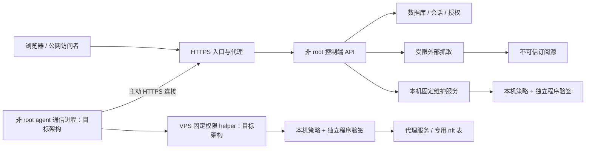

# VpsCT 完整系统安全设计

> v0.1.2 发行更新：默认采用官方 HTTPS 与 SHA256，不要求发布签名密钥、独立信任根或元数据服务。本文中的强制签名、签名撤销和安全代次要求属于此前设计或可选签名模式，不代表默认发行版保证。最终安装与迁移方式以 [README](../README.md) 和 [迁移说明](security-migration.md) 为准。

## 1. 状态与目标

后续补强与功能兼容约束见 [第二轮安全加固方案（待实施）](security-hardening-v2.md)。

2026-09-16 修订设计稿，基于当前本地源码定向检查。本文保留原设计要求；当前实现和本地验证记录见 [security-validation.md](security-validation.md)，安装兼容变化见 [security-migration.md](security-migration.md)。这些保护尚未发布或部署到真实 VPS，不构成完整渗透测试或认证。

主要前提：管理员账号未被盗，攻击者不知道管理员密码，也没有合法管理员会话。目标是阻断未登录接管、成员越权、正常登录用户被恶意网页借用身份、外部数据注入、内网探测以及程序更新链攻击。正常查看、部署、编辑节点不增加逐次确认。

纵深目标：即使软件漏洞导致某个进程失陷，也限制它跨越设备与 root 执行边界。账号已经被盗后的双人审批、硬件密钥和冻结策略属于另一个专题，不作为本次上线前置条件。不新增通用远程终端、文件管理、配置上传托管或公开注册功能。

必须承认的边界：掌握控制端应用和数据库的攻击者仍可能读取其中的节点凭据、滥用已授权的代理配置、停用服务。签名不能消除这些影响。VPS 的 root 已失陷时，本机策略无法保护该机器；发布签名或受信构建流程失陷也属于独立风险。

### 1.1 实施前证据与优先级

| 观察 | 代码位置 | 判断 |
|---|---|---|
| 生产 SPA 使用内嵌文件系统；会话使用随机 token 的数据库记录 | `web/embed.go`、`internal/api/auth.go` | 避开哪吒的磁盘静态文件穿越→JWT 密钥泄露路径，不等于全站文件接口均已审计 |
| 服务器和节点管理接口要求 admin | `internal/api/api.go` | 有基础角色隔离，仍需逐资源和批量操作权限测试 |
| 外部订阅抓取只有协议与大小/时间限制 | `internal/subscription/importer.go` | 缺少目标地址、DNS 与重定向防护 |
| 普通写接口没有统一来源检查；维护接口有额外检查 | `internal/api/api.go`、`maintenance.go`、`internal/httpx/httpx.go` | 应建立统一 CSRF 边界，不能只依赖 SameSite |
| SSE 未限制连接总量；gzip 日志只限制压缩体 | `internal/api/misc.go`、`agent.go` | 有资源耗尽风险，尚未做负载复现 |
| 自更新接受控制端给出的 URL 与 SHA256 | `internal/agent/update.go`、`internal/maintenance/worker.go` | 内容一致性校验，不是独立发布者认证；旧心跳更新和维护更新必须一起治理 |
| 内核下载地址和哈希来自 desired state；哈希为空时跳过验证 | `internal/core/install.go`、`internal/agentproto/proto.go` | 内核也是可执行代码，不能只给 agent 增加签名 |
| root 维护 socket 可被控制端组访问；二次认证在 API 层 | `internal/maintenance/socket.go`、`internal/api/maintenance.go` | 应用进程失陷可绕过 API 层二次认证；Unix socket 本身不是这个威胁的隔离措施 |
| 无效订阅 token 在进入现有限流之前查询数据库；短链先查询 | `internal/api/public.go` | 入口预算应覆盖无效凭据，不能只对有效订阅限流 |
| 头像校验限制类型字符串、Base64 和字节数 | `internal/api/account.go` | 还需验证实际图像、像素预算和重编码；不是已确认 XSS |
| CI 已有 race、容器集成、秘密扫描和依赖扫描 | `.github/workflows/ci.yml` | 保留并扩展攻击回归，不重复声称这些能力尚未建设 |

表内风险来自静态代码检查，不能等同于已复现的完整利用链。生产环境是否存在额外代理限制，本次未核实。

### 1.2 威胁模型与保护资产

| 攻击者/输入 | 可以做什么 | 必须阻断的结果 |
|---|---|---|
| 公网匿名访问者 | 任意请求、路径编码、伪造请求头和大量连接 | 绕过认证、读取秘密、初始化抢占、资源耗尽 |
| 合法普通成员 | 用自己的账号请求任意资源 ID | 读取其他成员数据、获得管理员能力 |
| 恶意网页/被控制的同站子域 | 诱导正常用户点击、嵌入页面或提交表单 | CSRF、点击劫持、DOM/存储型 XSS |
| 外部订阅/规则内容提供方 | 返回任意响应、重定向、压缩体与结构化内容 | SSRF、解析器失控、客户端配置注入 |
| 假 agent 或单台异常 agent | 伪造身份，或用自身身份上报异常数据 | 跨设备读取配置、污染其他设备数据、拖垮控制端 |
| 下载链路/镜像异常 | 替换文件、返回旧版本、恶意归档 | 未验证程序执行、回退到禁止版本、越界写盘 |

保护资产包括管理会话、TOTP 秘密、节点凭据、订阅访问凭据、服务器配置、计量数据、审计、备份、TLS 私钥、发布信任根和服务可用性。日志中的客户端 IP 与域名按敏感运行数据管理；不得进入源码、测试夹具或公开报告。

不承诺抵御浏览器/操作系统本身的未知漏洞、已掌握宿主 root 的攻击者或超出链路容量的流量攻击；应用层保护仍须正常生效，不能以这些边界为由省略。

## 2. 信任边界与权限模型

图中是信任边界目标；已实现网络处理降权子进程和固定 root 执行动作，具体进程范围见迁移说明。设备端无管理入站监听；公网数据面端口与 agent 管理协议分开。

### 2.1 四类入口分别认证

| 入口 | 身份与授权 | 限制 |
|---|---|---|
| 管理网页 `/api/v1` | 服务端会话、角色、资源授权、CSRF | 默认拒绝；前端隐藏按钮不作为授权 |
| agent `/api/agent/v1` | 每台独立凭据，服务端绑定 server ID | 不接受请求指定其他服务器身份，不授予管理员能力 |
| 维护回调 | 单任务、短期 capability | 绑定任务、服务器、动作和状态机，只允许 claim/report |
| 公开订阅 `/s`、`/r` | 高熵且可撤销的访问凭据 | 只输出授权订阅，独立限流，不转用为管理或 agent 凭据 |

权限判断统一为 `authorize(actor, action, resource)`，分别覆盖对象查询、列表、导出、预览、事件流和批量接口。批量操作先校验每个对象；任一未授权即拒绝整批。普通成员只能读取明确分配的分享和订阅，不能靠猜 ID 读取他人的内容。

事件总线也必须按资源归属过滤，不能仅按事件类型过滤。数据库模型不直接作为 API 返回对象，使用明确字段的响应结构，避免后续添加秘密字段时意外暴露。

### 2.2 操作分级与体验边界

| 操作 | 默认授权策略（待实现） |
|---|---|
| 查看自己获授权的资源 | 普通登录 |
| 部署节点、调整日常配置 | admin 登录，受本机配置能力上限约束 |
| 修改管理员、重置 agent 身份、批量编辑/删除 | admin + 统一来源/CSRF + 全量目标校验；保留现有交互确认，不新增普遍二次登录 |
| 修改自己的密码/第二因素 | 保留凭据校验；验证更新原子性和会话失效 |
| agent 自动同步 | 安装时本机授权的“仅受信签名版本”策略；自动同步仍无需逐次确认 |
| 网页升级/卸载/清空数据 | 保留现有密码、已启用第二因素及目标确认；最终 worker 还须通过本机能力检查 |
| 放宽本机能力、降低安全版本底线、修改信任根 | 本机操作；网页不能自行开启权限 |

现有维护二次认证若提取成授权记录，必须绑定用户、当前会话、动作、目标 ID 列表和参数摘要，建议有效期 5 分钟、单次原子消费；不能变成整个会话通用的“跳过验证”标记。安全判断以服务端和执行端为准，不用增加弹窗代替漏洞修复。

### 2.3 路由注册契约

将易误用的 `admin bool` 逐步替换为显式路由策略：身份类别、动作、资源解析器、媒体类型、请求预算与是否允许流式响应。公开路由逐条登记；未声明策略的管理路由注册失败。启动/CI 校验路由全集，不依靠开发者记住给每个 handler 加检查。

中间件顺序：请求 ID 与通用响应头→可信 Host/代理解析→全局准入与请求头预算→路由分类→身份认证→来源/CSRF（浏览器写接口）→角色/对象授权→限额内解码与业务校验→事务/任务入队→脱敏审计。资源 ID 的有限语法解析可先于授权，但不能先渲染、下载或产生副作用。

对禁止访问和不存在的私有资源保持一致响应。带 cookie 的浏览器接口与 Bearer agent 接口不能相互回退认证；维护回调也不得拿普通 agent token 替代任务凭据。

## 3. 先封住公网入口

### 3.1 统一浏览器请求防护

建立 `internal/security` 的会话写请求中间件，并统一接入前端 API 客户端：

- 所有浏览器写操作使用 POST/PUT/PATCH/DELETE；GET/HEAD 不触发部署、删除、凭据变更等操作。公开订阅允许访问统计，不引入管理副作用。
- 校验完整 Origin（协议、主机、有效端口）与本机配置的管理站点一致，拒绝 `null`、不匹配或缺失来源；兼容确无 Origin 的客户端必须使用独立认证协议，不给 cookie API 留跳过开关。
- 登录、初始化也校验来源；登录后写请求另要求与会话绑定的 CSRF token，自定义请求头携带，退出和会话轮换时失效。
- JSON 接口严格解析媒体类型；上传头像等非 JSON 接口显式登记允许类型，仍执行来源与 CSRF 检查。
- `Sec-Fetch-Site` 作为附加信号，不能把 `same-site` 当成 `same-origin`。不开放带凭据的跨域通配访问。
- 生产 HTTPS 使用 Secure、HttpOnly、host-only cookie；迁移到 `__Host-` 名称时让旧会话重新登录。SameSite 保留为纵深保护。
- 保留现有可配置会话期限，补齐更改密码/权限/第二因素时的会话撤销测试。SSE 定时重验会话和权限，撤销后最迟 30 秒断开；后台自动重连不能延长绝对期限。

Canonical URL 使用本机配置，不从任意 Host 或转发头推导安全判断、安装命令和绝对链接。代理信任改为 CIDR 配置，只信任明确的直连反向代理；生产入口拒绝未配置 Host。开发模式只绑定 loopback，不能静默放宽生产规则。

页面增加 CSP、全页面 `frame-ancestors 'none'`、nosniff 与严格 Referrer-Policy；对头像、订阅名称、日志、外部错误消息做 XSS 检查。CSP 先报告验证，再强制执行，不以放开 `unsafe-eval` 消除报错。

浏览器基线：脚本仅自有构建资源，`object-src 'none'`、`base-uri 'none'`、`form-action 'self'`、`connect-src 'self'`；图片与样式权限按实际用法收敛。报告发送到本机有配额的接收点，避免把含凭据 URL 发送给第三方。页面不加载第三方统计脚本。

React 插值保持默认转义；URL 属性另做协议白名单，不能认为 HTML 转义就能过滤危险 URL。日志/订阅/错误均按文本展示。现有二维码 SVG 的 `dangerouslySetInnerHTML` 必须核对生成库的字符串边界并加入恶意内容用例，不能仅凭搜索到该 API 宣称存在漏洞。外链使用 `noopener noreferrer`，跳转参数只允许站内相对路径。

浏览器会话不放进 URL 或 localStorage；会话响应、秘密响应和订阅响应禁止共享缓存，service worker（如未来引入）不得缓存这些数据。用户退出后清除前端内存中的秘密与请求缓存。

### 3.2 统一出站请求防护

新增 `internal/safehttp`，按用途创建不同客户端，首先接管外部订阅抓取：

- 默认 HTTPS；遗留 HTTP 订阅需明确启用兼容策略。拒绝 URL 用户信息、异常主机表示及非 HTTP(S) 协议。
- 默认只连接公网单播地址；拒绝 loopback、私网、链路本地、云元数据、未指定、多播及保留范围。规范化 IPv4-mapped IPv6，对转换地址与混合 A/AAAA 结果做专门测试，不能只调用 `IsPrivate`。
- 在实际拨号阶段解析、验证并固定目标 IP，TLS SNI 与证书验证仍使用原主机名，防止“验证后再次解析”被 DNS rebinding 绕过。
- 最多 3 次重定向，每跳重新校验；禁止 HTTPS 降级 HTTP，跨来源不转发认证头。外部抓取不携带面板/agent 凭据，不读取隐式环境代理。
- 连接、响应头、总时长与解压后大小分别限制；超限返回错误，不把截断内容当成功。初始建议连接 5 秒、响应头 10 秒、总时长 30 秒、解压后 16 MiB。
- 确需内网订阅时，由本机配置精确来源和目标范围的例外，不提供网页“允许全部内网”。例外不自动继承给重定向目标。

发布下载、Telegram、GeoIP、agent 回连使用各自来源策略，不能机械套公网订阅规则而破坏合法私网控制端。GeoIP 保持默认关闭。生产可增加仅针对抓取进程/容器的出站网络限制，不能全局阻断同机组件。

### 3.3 资源预算与反滥用

以下为待负载测试的初始默认值，不是已测容量：SSE 每用户 5 条、全局 100 条；外部抓取全局并发 4；心跳请求 1 MiB；连接日志压缩体 2 MiB、解压后 8 MiB、每批 10,000 条。前后端、agent 同步更新批次策略并允许本机调节。

按账号、agent、订阅凭据和可信客户端地址分别限流；限流表自身有硬容量和过期淘汰。SSE 设置写超时和慢客户端退出，普通请求设置读取期限，不用全局短 WriteTimeout 误杀长连接。请求字节、JSON 深度/条数、单字段长度、磁盘日志保留和数据库增长都需要上限。

登录密码验证增加全局并发信号量，初始建议 2 路 Argon2id 验证（当前单次内存参数 64 MiB），队列满返回 429/Retry-After；按账号+可信来源限流，不用永久锁账号让攻击者制造拒绝服务。上限以控制端 512 MiB 部署预算测定。不存在账号也使用受预算约束的统一认证失败流程；PHC 参数解析需校验合理上限与非零值。

路由准入限流在 token 查库前生效，包括 `/s`、`/r` 的无效 token；限制凭据长度，不为随机 token 建立无界限流键，不用无限并发 sleep 作为反枚举机制。公开静态资源缓存不共用管理接口预算，agent 心跳有独立配额，避免订阅流量挤占管理工作。

### 3.4 初始化、认证与输入一致性

初始化仍要求本机 0600 setup-token、数据库原子“仅首个管理员”插入和完成后令牌失效；恢复备份、清空会话或进程重启均不能重新开放无令牌初始化。并发登录挑战、TOTP 步长和恢复码采用事务/条件更新，验证与消费必须原子化。

所有 JSON 接口只接受一个完整 JSON 值，拒绝尾随内容和关键字段重复；安全敏感结构拒绝未知字段，版本化 agent 消息明确扩展规则。限制原始字节、解压字节、集合长度和每个字段的范围；更新采用专用输入结构，不能反序列化整个数据库模型造成角色/归属字段批量赋值。

SQL 查询使用参数绑定；排序字段、列名与动态标识符使用固定枚举。查询与分页设置上限，导出采用限额流式生成；错误返回稳定错误码和请求 ID，不把 SQL、磁盘路径、上游完整 URL 或堆栈直接发给客户端。

### 3.5 文件与图片

公开下载只能选择枚举架构对应的固定分发文件，拒绝目录、符号链接和非普通文件；任何路径归一化都必须在固定根目录边界内验证，不能仅检测字符串是否包含 `..`。SPA 始终来自 embed.FS，禁止“找不到时尝试磁盘任意文件”。

头像在限定字节下解析实际格式及宽高，设置总像素/帧预算，解码后重编码为固定支持的 PNG/JPEG；丢弃元数据，不支持 SVG/HTML。读取图片同样检查授权和固定 Content-Type，不相信 data URL 声明。历史图片在首次读取/后台迁移时校验，失败显示默认头像，不让恶意历史内容继续直出。

备份、setup-token、数据库、密钥、临时文件均不在 Web 根目录。写文件使用受控目录、排他临时文件、权限与文件类型检查、fsync 和原子替换；避免共享 `/tmp` 下可预测文件名引起链接攻击。证书内容、systemd 参数不能通过换行等字符注入其他配置项。

### 3.6 公开订阅与生成内容

`/s` token 与 `/r` code 都是读取订阅的凭据；短链不是认证弱化例外。新短链使用无偏随机编码、至少 128 位随机熵，可略短于完整订阅 token；现有短码在迁移中明确展示并安排轮换，不能悄悄使客户端失效。轮换时长短凭据共同更新，撤销/过期/禁用必须在缓存命中路径也检查。

公开订阅只读取已同步的外部内容快照，不能让每次下载触发上游抓取。模板和预设依照现有语义生成客户端配置；禁止恢复配置上传托管。外部输入只导入允许的代理字段，不把上游整份任意配置透传给客户端；模板由授权管理员维护，远程规则来源显式显示。

YAML/JSON/INI/URI 分别使用结构化序列化或语境正确的转义，名称中的换行、分隔符不得生成额外代理、规则、文件路径或更新地址。限制 YAML 深度/别名展开、节点数、规则数和渲染大小；未知格式拒绝，不执行模板中的代码或触发文件读取。

反向代理/CDN 对 `/api`、`/s`、`/r` 禁止公共缓存，访问日志隐藏完整 token 路径和查询参数；下载响应不渲染为 HTML。正确区分“撤销订阅下载资格”和“撤销已下载的代理凭据”：后者需要节点凭据轮换或撤销分享，不能承诺删除链接就让旧配置立即失效。

## 4. 程序更新与系统执行边界

### 4.1 可执行程序必须有独立的信任来源

采用成熟 TUF 更新元数据验证方案，避免自创只签一个 SHA256 的协议。具体 Go 库在实施前验证维护状态、依赖、许可证与互操作测试；不在此设计中虚构已选依赖。

- 首次可信安装固定根公钥；根密钥离线保存，常规发布密钥与控制端隔离，根轮换采用旧、新根共同满足签名门槛的验证流程。
- 签名目标元数据绑定产品、组件、架构、版本、安全代次、大小与哈希；snapshot/timestamp 负责一致性和时效。验证使用本机时间，不能信任面板返回的 ServerTime；时钟不可靠时拒绝新更新并保留现有服务。
- agent、控制端安装包、安装器和代理内核都纳入验证。第三方内核由发布流程核对来源后登记进受信目录；无哈希或无受信记录时拒绝新安装，不能静默绕过。
- 控制端可转发下载文件和签名元数据，但不能生成可信签名。验证失败、过期或下载失败时维持原程序，不降级为未签名更新。
- 校验通过之前不能执行下载程序，连 `version` 子命令也不允许；解压文件数、展开字节数、类型、最终路径均受限，拒绝链接和越界写入。
- 持久化已接受元数据版本与安全代次；禁止回退到已封禁代次。健康检查失败时只回退本机保存的、验证过且不低于安全底线的上一版本；不重新接受面板给出的任意旧版本。
- 自定义构建仍可支持，但需要安装时在本机登记自有信任根。网页不能临时信任未知签名。

签名解决“谁发布了程序”，不证明程序无漏洞；受信旧版本仍可能有缺陷，所以还需要版本撤销、代次和更新时效。元数据过期阻止新变更，不停止已经运行的代理。

### 4.2 本机能力上限

新增 root 拥有且应用不可写的本机策略文件；实际路径、权限与安装器一起落地。安装时声明允许日常配置、受信更新及哪些网页维护动作，保留用户已选择的维护能力；策略默认拒绝未登记动作。不能静默关闭现有网页卸载，也不能让面板远程扩大到任意删除目录。安全边界是固定端、固定路径、固定动作，以及不允许远程放宽策略。

agent 和控制端维护 worker 都在最终执行处检查本机策略，不能仅检查 API。策略变更仅接受本机操作；禁止控制端给自己签发“绕过策略”的凭据。已由用户允许的网页卸载仍可能在应用进程被攻破后遭到滥用，这是保留该能力的明确边界；需要更强隔离的安装可以本机关闭，不把它包装成已解决的风险。

期望配置也不等于可信输入：限定内核枚举、节点数量、监听端口范围、参数 schema、流量/日志限额及调优项；阻止注入任意配置文件、systemd 指令、环境变量、下载模板和 shell。外部证书使用本机登记的证书 ID，面板不能传任意磁盘路径。

同一策略必须覆盖旧 `AgentUpdate`、网页维护、内核安装、证书处理和调优路径；不能只保护新入口，保留旧入口绕过。保留 `HoldUpdates` 作为紧急本机开关，但说明它当前会同时暂停网页维护。

### 4.3 逐步降低 root 暴露

控制端保持非 root，程序、信任根、安装来源和可执行分发文件均不可由应用用户写入；不再把应用可写数据目录当作可信程序来源。

第二阶段将 agent 的网络通信/解析与固定权限 helper 分离：非 root 进程处理心跳，helper 独立验证 schema、签名和本机策略，只修改所属配置目录、专用 nft 表和固定服务。socket 认证调用者身份，但不因调用者身份正确而跳过内容验证。

helper 不提供通用执行、任意读写文件或任意 systemctl 接口。systemd 单元由固定模板产生；路径处理防符号链接与检查后替换竞争。代理内核尽量独立非 root 运行，按协议实测授予最小能力。不能直接给现有 agent 套严格 sandbox 后声称完成隔离，必须验证网络、nft、证书和安装功能。

### 4.4 维护状态机与竞争条件

维护任务状态定义为 queued→claimed→running→成功/失败/回退/待核实；实际数据库字段可沿用现有命名，但转换条件必须明确。claim 原子比较任务 ID、目标、期限和当前状态，重复消息返回已有结果，不重复卸载；报告只允许当前任务的合法后继状态。

worker 再次检查安装端、目录归属、版本策略与排他锁；控制端与 agent 共用父目录时保持隔离，不删除整个共享目录。固定脚本以参数数组调用，环境固定，不接受网页传入命令、任意 repo、路径或环境变量。检查过的下载文件保持同一可信对象直到执行，避免检查后被替换。

执行中禁止删除对应服务器或重置任务身份；注销/取消与执行使用状态条件更新，不能声称已取消正在完成的不可逆步骤。断电后恢复任务只核对已完成步骤，卸载不盲目重放。回调凭据仅允许报告一个任务，不可换取 agent 会话，回调 URL 固定且拒绝重定向。

## 5. 设备通信、数据与部署运行

### 5.1 agent 身份与重放

每台 agent 独立 token，服务端只存哈希，本机 0600；注册凭据短期、单次且原子消费。轮换按设备进行，旧 token 在有限交接窗口后失效；撤销后不能继续下载配置或上报。

生产回连强制 HTTPS 和完整证书校验；私网允许本机配置信任的 CA，不接受面板下发跳过 TLS。带凭据的请求拒绝重定向。首次注册从已验证安装包进行，初始信任不能依靠可能已失陷的面板脚本建立。

配置绑定本机 server ID、revision 和内容摘要。历史 revision 不能覆盖新配置；已成功任务持久化去重。需要回退配置时创建新的 revision，不能放松重放限制。

agent 上报属于不可信数据：只能影响自己的节点/计量，限制时间戳、数值、字符串和日志批次。不能让单台 agent 的输入改变全局设置或其他机器的数据。

新注册 token 建议 15 分钟有效期，随机强度至少 256 位；单次消费使用数据库条件更新，重置令牌需使旧凭据失效。TLS 与 token 是首期方案，不为修这些漏洞强制引入难以运维的全套 mTLS；若以后新增证书身份，应单独设计签发、轮换和撤销。

每台 agent 的无效配置不得持续触发高频重试或不断重启代理，使用有上限的退避、失败记录和人工可见状态。心跳中的轮询周期在本机合理范围内截断；配置代次、流量计数不得溢出或产生负值导致配额绕过。节点归属检查应用于心跳、流量、诊断、connlog 和执行报告全部入口。

### 5.2 秘密存储与数据生命周期

密码继续使用 Argon2id；会话与 agent token 在控制端保存哈希。必须能再次提供给客户端的节点密码、订阅链接等秘密无法只存不可逆哈希，应按需要加密存储，密钥在独立受限文件中、与数据库备份分离；它保护离线备份泄露，不承诺抵御能读取解密密钥的进程失陷。

秘密响应使用明确 DTO，仅给已授权资源返回必要字段，日志永不记录秘密。API 错误、上游错误、CSP 报告、审计和反向代理日志均有统一脱敏。严禁开发测试复用真实数据库、订阅 URL 和 VPS 地址。

数据目录、SQLite 主库/WAL/SHM、备份与证书权限一并检查，不能只改主文件。日志建议默认保留 7 天、审计 90 天并设字节硬上限，具体值在迁移时按现有设置保留；超限优先清理过期诊断日志，不删除计量基线、身份数据和正在执行任务。在线 GeoIP 仍需用户明确启用。

### 5.3 部署基线与故障策略

- Release 安装器默认仅 loopback 暴露后端；手动二进制与 Docker 同样校验安全配置，不能仅凭安装器安全就宣称所有部署安全。Docker 不挂宿主根目录、Docker socket，不默认 privileged，明确非 root 身份、只读程序层和可写数据卷。
- 公网通过可信 HTTPS 入口，推荐 TLS 1.2 及以上；确认整个域名 HTTPS 就绪后启用 HSTS，不默认 includeSubDomains/preload 影响用户其他站点。代理去掉外部伪造的转发头再按可信链写入；应用按最近可信代理向外解析真实来源，不能取任意 XFF 首项。
- 不强制拆分多个域名；管理、订阅、agent 可共用域名，但各自独立认证和预算。可选 VPN/IP 白名单仅限制管理路由，不能误封公开订阅和 agent；WAF/CDN 是附加层，源站必须有相同应用校验。
- 原有控制端 systemd 限制保留，新增服务按照实际资源测试设置内存、进程数、文件描述符和写目录；root worker 权限按动作收紧，不盲目套用会阻断维护的参数。
- `/healthz` 只提供必要存活信息，详细版本、运行状态和调试数据限管理员；pprof、metrics、数据库调试端点不得默认公网开放。
- 权限库不可用时管理与订阅授权失败关闭，返回 503；不得把查库错误当成“不需要授权”。外部订阅同步失败保留上次有效快照并标注时间，不把空结果覆盖为成功。
- 控制端短时离线时，VPS 保持最后一次验证通过的配置，不因心跳失败卸载或开放额外端口。更新验证失败保留旧版本。安全敏感任务在审计持久化失败时不启动；普通事件日志失败不能使整个服务崩溃。

### 5.4 代理数据面边界

VpsCT 管理协议的安全不能替代代理内核安全。代理服务不开放匿名访问，节点凭据使用安全随机数、分享使用独立凭据；管理端口、数据库和维护 socket 不与代理监听混用。内核配置、路由参数、链式代理和转发目标均经过格式与资源范围校验，禁止参数变成 systemd/shell 指令。

新部署代理默认限制对 VPS 本机管理服务、元数据和内网管理网段的访问；确需私网转发时按节点显式配置例外，不能影响 agent 自身回连。不同内核的可实施方式在隔离环境验证，不能假定一个出站过滤规则适用于全部协议；无等价防护时明确显示边界。已有节点不静默改路由，给出迁移差异。

共享代理进程保持既有计量语义与数据归属，不改变流量汇总规则。单个分享撤销应禁止该分享后续连接，是否终止已有连接按内核能力明确说明；不得把“订阅已失效”当成“代理凭据已失效”。证书私钥不进入面板通用日志，ACME/外部证书行为也受本机路径和域名约束。

### 5.5 记录、备份与应急

记录登录异常、来源拒绝、SSRF 拦截、权限拒绝、更新签名失败、策略拒绝和敏感操作结果。只记录凭据标识/摘要，不记录 token、订阅完整 URL、节点密码或请求正文；日志需要配额、轮转和重复事件聚合。

本地审计不能声称防应用/root 篡改。可选向独立收集端发送脱敏审计，地址与认证由本机配置；默认不开启对外通知。数据库和证书等备份加密存放在独立目的地，定期做隔离恢复演练，不能只确认备份文件存在。

SQLite 使用一致性备份机制，不能在线只复制主文件忽略 WAL。设计恢复目标为配置数据最多损失 24 小时、可信环境中 60 分钟内恢复基础管理服务；这些是演练目标，不是现有 SLA。计量数据的恢复损失单独测量并展示，保留幂等序号/计量基线，避免恢复后重复计费。恢复后撤销旧会话和注册令牌，其他凭据按是否可能泄露分别轮换。

应急流程：本机暂停新配置和更新执行→隔离受影响控制端→从可信安装源重建→撤销管理会话及受影响 agent/订阅凭据→核对节点程序与本机策略→分批重新注册恢复。控制端已失陷时，不能依赖该控制端执行“安全修复命令”。恢复时保持现有代理服务，除非确认它们本身已被篡改。

## 6. 实施顺序与验收

### 6.1 第一批：公网入口与浏览器安全

实现统一 CSRF/Origin、safehttp、可信代理/Host、权限矩阵、SSE 与解压预算、公开无效 token 准入预算。完成图片与渲染审计，先消除已确认的危险路径再逐步启用 CSP。同步登记所有可执行更新通道；独立签名完成前展示保护状态及本机暂停程序变更选项，不能把现有 SHA256 标成“可信发布验证”。

受影响文件：`internal/api`、`internal/httpx`、`internal/subscription`、`internal/config`、`web/src/lib`；新增 `internal/security` 和 `internal/safehttp`。前端错误要区分来源被拒绝、权限不足、目标地址受限、速率超限，不能显示底层敏感 URL。

### 6.2 第二批：设备协议、维护与代码信任

发布流程产出签名元数据；安装器先验证；新 agent/worker 验证所有代码路径并读取本机策略。然后合并旧更新通道、加入安全代次与持久化防回退；拆分 root helper。

旧 agent 不具备验签能力，不能通过在控制端开启开关就宣称受保护。对每台机器显示“未迁移/已验签/本机策略生效”；首次迁移需要从可信来源在终端安装验证器或经可信的独立分发渠道完成，先一台 canary，再按明确选定的小批次扩展。绝不因兼容旧节点恢复未签名自动更新。内核版本仍由用户选中保存后升级，不追最新。

### 6.3 第三批：部署、数据生命周期与发布门禁

CI 保留现有 race、秘密扫描、govulncheck、npm audit 和隔离安装/卸载/维护检查，增加权限回归、解析器 fuzz 和签名验证。新增依赖同步第三方许可证。建立可执行文件清单/SBOM，锁定依赖和构建工具；构建结果与发布提交、架构绑定。签名发布使用受保护的发布环境，非受信 PR 不接触签名凭据，发布权限只授予发布步骤。当前草稿 Release 工作流保留，不自动发布。

为文件读取、导出、公开订阅、维护、agent 配置建立攻击面清单，新增入口必须登记认证与限额。已确认可利用的认证绕过、跨资源访问、任意执行和秘密泄露必须阻断发行；扫描例外需记录影响、理由、负责人和失效日期，不能永久忽略。依赖扫描结果不等于应用安全审计通过。

### 6.4 可独立合并的工作包

| 编号 | 范围与落点 | 完成条件 |
|---|---|---|
| S01 | `internal/api`、`httpx`、`web/src/lib`：路由策略、Origin/CSRF | 浏览器写操作全覆盖，agent/订阅兼容，负向权限测试通过 |
| S02 | 新 `internal/safehttp`、订阅抓取 | 拨号/重定向/DNS 测试证明不能连接禁止地址 |
| S03 | `auth`、`api`：认证并发、SSE、解压、公开准入 | 小规格控制端下资源有界，合法心跳不饥饿 |
| S04 | 前端、头像、订阅序列化与公开链接 | 恶意内容不执行、不生成额外配置，缓存/日志不泄露凭据 |
| S05 | `agentproto`、`store`、`agent`：身份、重放、任务状态 | 并发注册只成功一次，跨设备数据被拒绝，任务不重复执行 |
| S06 | Release/安装器/core/maintenance：可信更新 | 所有程序执行前验签，旧入口不能绕过，失败可安全恢复 |
| S07 | agent/helper/systemd：执行边界 | 固定动作/路径/服务，非 root 网络处理，既有节点功能通过集成测试 |
| S08 | 部署、日志、备份、CI | 三种部署方式配置核对、恢复演练及安全发布门禁完成 |

S01–S04 先行；S05 与 S06 的协议变更先设计版本协商，再升级兼容控制端和 canary agent；S07 依赖受限任务契约。签名元数据使用成熟协议，但具体库选型、信任根保管和内核目录维护是 S06 的实施前交付项，不得留成隐含前提。

### 6.5 验收矩阵

| 必须通过的场景 | 预期结果 |
|---|---|
| 未登录访问磁盘路径及编码穿越变体 | 不返回磁盘秘密；静态资源仍正常 |
| 普通成员访问他人资源、混合批量 ID、SSE | 无越权数据，无部分越权变更 |
| 跨站表单、同站恶意子域、Origin 缺失/伪造代理头 | cookie 写接口拒绝；正常网页可用 |
| 订阅指向私网、DNS 切换、IPv6 变体、重定向到元数据 | 实际目标连接前阻止，不仅校验 URL 字符串 |
| 大 gzip、小压缩体、高并发 SSE、慢读写 | 有界内存/时间，明确拒绝，合法 agent 心跳仍可用 |
| 单台 agent 伪造其他 server/node ID，注册并发重放 | 不跨设备访问，注册单次成功 |
| 面板同时替换程序和 SHA256，走旧更新/内核入口 | 独立签名拒绝，旧程序继续运行 |
| 已签名旧代次、过期元数据、错误架构、恶意归档 | 执行前拒绝，不触发 `version` 或安装脚本 |
| 模拟 API 进程直接调用 root socket 清空数据 | 本机策略拒绝，不能依赖 API 密码检查 |
| 升级断电、签名密钥轮换、撤销版本、健康检查失败 | 状态可恢复，安全底线不回退，必要时保留旧服务并报告人工处理 |
| 恢复加密备份并撤销旧凭据 | 恢复可用，旧会话/token 不恢复有效 |
| 已正常登录的浏览器打开恶意网页、iframe、同站恶意子域 | 无管理变更；页面不能被嵌套诱导操作 |
| 订阅名/日志/头像/二维码输入含主动内容、异常图片与多行字段 | 页面不执行内容，生成配置不被注入，解析资源有界 |
| 随机无效长短 token、巨型 token、失效但缓存命中的订阅 | 查询前受限；撤销即停止下载；日志不落凭据 |
| 注册/第二因素/维护报告并发重复、撤销期间 SSE | 原子消费，无跨任务更新，事件权限及时失效 |
| 伪造代理头、绕过入口直连、Docker/手动部署默认配置 | 不绕过限流和 Secure cookie/来源规则，不暴露调试接口 |
| 代理节点访问宿主管理服务、授权私网转发例外 | 默认边界生效，例外只影响指定节点，正常代理业务可用 |

测试在 httptest、临时目录和隔离容器中完成；维护与卸载继续使用 `scripts/test-maintenance-container.sh`。不对真实 VPS 做攻击验证。前端修改后执行 typecheck/build 和浏览器操作验证；Go 改动完成相关测试及 `make check`。本文设计本身不构成测试通过证据。

浏览器测试必须使用真实浏览器和两个不同 origin，覆盖与面板同站的不同子域；仅用 curl 伪造 Origin 不能证明 Cookie、CORS、CSRF 和 CSP 行为正确。负载测试记录基线、峰值内存、连接数、拒绝率和心跳延迟，不能只断言收到 429。

### 6.6 兼容迁移与发布判定

安全配置加入显式 schema/protocol 版本。迁移前列出 HTTP 订阅、内网来源、弱短码、历史图片、未验签程序和不安全代理信任配置；用状态说明与修复指引解决兼容问题，不能为了旧配置恢复全局跳过校验。

CSRF 前后端同版发布，旧页面遇版本不匹配提示刷新，cookie 改名时允许一次重新登录；不长期接受旧无防护写请求。内网例外由本机精确登记，HTTP 兼容只给指定来源。短链改动安排可见的轮换窗口，严重泄露时直接撤销。

首次签名根必须来自独立可信安装渠道；旧版远程更新无法凭空建立独立信任，迁移状态保持可见。更新失败回退须满足安全代次和数据库兼容要求，不允许因为 UI 不兼容就回退到已知漏洞版本。发布说明分别列出“控制端已生效”“需 agent 升级”“需本机配置”的能力。

只有 S01–S08 对应验收证据齐备后，才可宣称此设计已完成；提前发布的批次明确列出仍未完成的保护，不写“彻底安全”。

## 7. 设计依据

- [OWASP ASVS 5.0.0](https://github.com/OWASP/ASVS/releases/tag/v5.0.0)：以适用的 L2 要求作覆盖检查，并针对 root 维护与程序更新补充高风险控制；这是设计目标，不是认证声明。
- [OWASP XSS 防护](https://cheatsheetseries.owasp.org/cheatsheets/Cross_Site_Scripting_Prevention_Cheat_Sheet.html)与[文件上传防护](https://cheatsheetseries.owasp.org/cheatsheets/File_Upload_Cheat_Sheet.html)：核对内容语境、浏览器输出及实际图片校验。
- [OWASP SSRF 防护](https://cheatsheetseries.owasp.org/cheatsheets/Server_Side_Request_Forgery_Prevention_Cheat_Sheet.html)：用于核对地址验证、DNS 与重定向边界。
- [OWASP CSRF 防护](https://cheatsheetseries.owasp.org/cheatsheets/Cross-Site_Request_Forgery_Prevention_Cheat_Sheet.html)：用于核对来源、token 与 SameSite 的分工。
- [TUF 概览](https://theupdateframework.io/docs/overview/)与[安全模型](https://theupdateframework.io/docs/security/)：用于区分内容校验、发布身份、元数据时效和防回退。

资源额度、会话时间、操作分级和迁移策略是本项目的设计建议，不是这些标准规定的固定值；实施时应按现有安装兼容性和负载测试结果调整。
