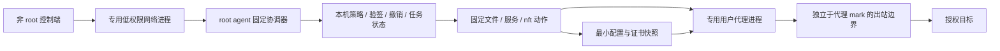

# VpsCT 第二轮安全加固方案：功能兼容优先

> v0.1.2 发行更新：默认采用官方 HTTPS 与 SHA256，不要求发布签名密钥、独立信任根或元数据服务。本文中的强制签名、签名撤销和安全代次要求属于此前设计或可选签名模式，不代表默认发行版保证。最终安装与迁移方式以 [README](../README.md) 和 [迁移说明](security-migration.md) 为准。

## 1. 状态、范围与交付标准

2026-09-16。本文是**实施基准设计**，当前进度见 [实施记录](security-hardening-v2-progress.md)，覆盖上一轮验收后的六项补强：代理权限隔离、网络能力收敛、撤销与回退、磁盘生命周期、生产签名运维、扩大验收。不是已实现或已上线声明。第一轮成果与测试边界见 [安全验收记录](security-validation.md)，基础安全要求继续遵循 [系统安全设计](security-design.md)。

硬约束：正常功能、已有数据、访问凭据和使用方式不能因加固退化。不能关闭协议、放弃计量、停用自动续证、删除用户备份来使安全测试通过。环境不能安全兼容时，迁移在停服前阻止，旧服务保持运行，并明确显示尚未迁移；这不算该环境通过验收。

“不影响功能”不等于承诺迁移零连接中断。变更进程身份可能必须重启代理，既有 TCP/QUIC 会话可能断开。上线前必须明确这一影响并在维护窗口完成；若用户要求零中断，则当前切换方案不得上线，先另行验证连接排空/并行承接。平时查看、部署、订阅、分享不增加逐次二次认证。

### 1.1 必须保持的功能契约

| 功能 | 不允许退化的行为 |
|---|---|
| 协议 | 仓库实际声明可部署的每个协议均保留；仅导入/订阅转换的协议不误列为服务器端支持 |
| 网络 | TCP/UDP、IPv4/IPv6、DNS、低端口、现有链式代理和明确授权私网转发均建立真实测试 |
| 证书 | 自签名、ACME 续期、外部证书 ID 正常；不要求代理获得源证书目录或 ACME 账户密钥 |
| 计量 | 入站=网卡收，出站=网卡发，汇总=入+出；分享不乘 2，Snell 不叠加两套计量 |
| 资源 | 默认共享 sing-box、Snell 每节点进程及整体内存预算保留；新增隔离进程需预估资源并明确展示 |
| 管理 | agent 只出不进；断连不停止已有代理；节点部署/修改/撤销、分享、订阅和配置重发继续可用 |
| 更新 | 内核版本仍手动选中保存才更新；agent 受信更新、失败恢复、安装/卸载幂等继续保留 |
| 数据 | 不轮换无关凭据、不重置配额/计量基线、不改变模板/预设语义、不恢复配置上传托管 |

### 1.2 实施前源码确认的问题

- `internal/core/systemd.go` 的代理单元使用 root，拥有 NET_ADMIN/NET_RAW，并允许写整个 agent 数据目录。只读系统分区不能隔离同一 root 身份可读的 agent 凭据。
- `internal/nft/egress.go` 中 sing-box 的目的地址限制依赖进程可设置的 mark；必须增加独立于 mark 的进程边界。
- `internal/secureupdate/verify.go` 的离线回退检查验证记录与代次，尚未关联精确摘要的持久撤销记录。
- `internal/maintenance/worker.go` 直接追加 worker.log；任务目录扫描、升级快照和保留日志缺少统一总量预算。
- 已运行的集成环境是 Linux arm64；amd64 编译通过不等于实机通过。Snell cgroup 测试不等于所有真实客户端组合已测。

这些是设计依据，不等同于已复现完整远程利用链。

## 2. 目标进程与文件边界

图中的箭头表示数据/配置流，不开放新的 agent 入站端口。网络进程仍由本机协调器启动，控制端不能直接连接它。

### 2.1 身份与职责

| 进程 | 目标身份与权限 | 禁止事项 |
|---|---|---|
| 控制端 | 现有 ctlvps 用户 | 读取签名私钥、修改 root 策略或代理程序 |
| agent 网络子进程 | 专用 ctlvps-net 用户，无额外组；不复用 nobody | 读取持久 agent 状态、访问维护 socket、执行管理动作 |
| agent 协调器/维护 worker | root，仅固定动作和受校验参数 | 任意命令/路径/服务名/仓库；执行未验证文件 |
| 默认 sing-box 进程 | 专用 ctlvps-singbox 用户 | 读写 agent 凭据、数据库密钥、维护状态、更新信任状态 |
| Snell 实例 | 稳定的每节点身份或经过验证的等效文件隔离 | 读取其他节点凭据；把隔离建立在代理自己上报的节点 ID 上 |

UID/GID 由安装器创建并记录，不硬编码跨机器数值。系统用户名称冲突、已有不安全组成员或目录归属异常时，预检查失败；不擅自接管既有账号。用户生命周期与节点退役对应，停止全部相关进程后才清理身份。

不引入通用 root RPC。固定执行接口仅包括：应用已校验配置、发布证书快照、启停固定受管服务、替换本产品 nft 规则、安装/回退受信程序、按角色清理。每个请求绑定本机 server ID、revision、参数摘要、动作和幂等 ID，最终执行前重验本机策略。

### 2.2 文件权限与证书交付

| 路径/数据 | 所有者及可见范围 |
|---|---|
| `/var/lib/ctlvps-agent` | root 专有，0700；代理不可遍历或挂载可见 |
| `/var/lib/ctlvps-security`、维护目录 | root 专有；不进入代理挂载视图 |
| 原始证书、ACME 账户状态 | root 管理，代理无源目录访问权 |
| `/etc/ctlvps/runtime/<实例>/<代次>`（新增） | root 写入，实例用户只读；仅必要配置、证书和私钥 |
| `/var/lib/ctlvps-proxy/<实例>`（新增） | 仅该实例必要运行状态可写，按容量限制 |
| `/var/log/ctlvps/<实例>` | 仅必要日志，按实例分权和轮转；agent 只按固定路径采集 |

目录祖先 root 拥有、不可被实例用户替换。读源文件使用描述符校验普通文件、链接及根目录边界，写入使用排他临时文件、fsync、原子切换。禁止递归 chown 整个共享 `/etc/ctlvps` 或 `/var/lib/ctlvps-agent`。

证书更新采用“新快照校验→检查证书/私钥匹配、域名与有效期→目标进程身份执行配置检查→激活→握手探测”。失败保留有效旧快照；不 chmod 放宽整个源目录。私钥在代理内存中仍可见，这是终止 TLS 的必要权限。共享 sing-box 的节点凭据同属一个进程安全域，不宣称进程内节点能相互保密。

### 2.3 systemd 约束

在实际支持矩阵逐项验证 User/Group、NoNewPrivileges、只读程序与配置、独立可写目录、ProtectHome、ProtectControlGroups、ProtectKernelTunables、进程/文件数和内存预算。进一步限制 `/proc`、设备、命名空间和系统调用前先验证内核及 systemd 支持情况。使用不可访问路径和独立挂载视图作为纵深保护，不以单个 hardening 评分代替功能验收。

代理不得获取宿主 NET_ADMIN。低端口按需要授予 NET_BIND_SERVICE，不改整机非特权端口策略。NET_RAW 只在实际 SO_MARK 等需求验证后保留；若保留，额外阻止 AF_PACKET 以及 AF_INET/AF_INET6 原始套接字。不能粗暴禁止所有 SOCK_RAW 而破坏合法 NETLINK 查询。系统调用过滤失败时不得静默禁用过滤后标为“已保护”。

## 3. 网络权限与计量兼容

### 3.1 标记的用途分离

节点 mark 继续服务于计量和合法策略路由，但不作为唯一安全身份。为默认代理进程所在的受管 cgroup/专用身份增加基础目的地址保护；即使进程使用 mark=0、伪造另一节点 mark 或修改路由参数，也不能绕过基础限制。规则由 root helper 创建，代理不能修改 nft、迁移 cgroup 或创建逃逸命名空间。

TCP/UDP 分别覆盖出站新连接与正常回包；不能依靠未经测试的 conntrack 方向假设。UDP 未关联流、IPv6 扩展头、分片与 raw socket 作为负向测试。DNS 只允许固定解析器和必要端口；解析器变化必须由本机受信配置重建规则，不能从代理输入扩大例外。

### 3.2 SO_MARK 的兼容路径

Linux 手册指出 SO_MARK 需要 NET_ADMIN，或自 Linux 5.17 起可以使用 NET_RAW。因此按实际功能探测选择后端，不只看发行版名字或版本字符串。

| 环境 | 计划路径 | 激活条件 |
|---|---|---|
| 可用 NET_RAW 设置 SO_MARK | 专用用户 + 必需能力 + 原始套接字限制 + cgroup 基础防护 | 所有实际协议与计量通过 |
| 旧内核必须 NET_ADMIN | 研究将代理放在专用网络命名空间，仅授予该 namespace 内权限；宿主维护入口在 namespace 外 | veth、MTU、IPv6、DNS、入站端口、UDP、mark/conntrack、计量均证明等效 |
| 两条路径均未验证 | 不激活新模式，保留运行服务，标为兼容阻塞 | 补充等效实现或经单独确认升级运行环境 |

旧内核 namespace 后端是必须先完成的兼容验证任务，不是默认已可用方案。不能要求用户为了本轮加固关闭计量或协议，也不能把重新赋予宿主 NET_ADMIN 当成安全回退。若需新增转发层，必须证明不会把 veth 流量重复记账。

### 3.3 私网与链式访问

默认仍使用一个共享 sing-box 进程。私网目的地址例外只存在于明确允许的来源进程与目的范围，元数据和宿主管理端点默认单独禁止。已批准的特殊管理目标访问需在迁移差异中逐项说明，不能静默取消已有合法用法。

同一个共享进程能修改自身所有 mark，因此不能承诺“恶意进程只能使用某一个节点的私网例外”。需要不同网络权限的节点按等效权限组拆入独立实例/cgroup；同权限节点仍共享，不变成默认每节点一个进程。Snell 保留既有每节点实例结构。

新增实例前展示增量内存、进程数及计量映射；容量不足时不迁移。原节点 ID、端口、客户端凭据和订阅内容保持。计量使用稳定节点身份，进程身份变化不能重置配额；必须实现停旧前最后采样、持久化边界、新 invocation 建基线、重试去重。Snell 保持现有 IPAccounting 单一计量来源；不能与 nft 数值相加。

## 4. 精确撤销、发布信任与安全恢复

### 4.1 撤销模型

保留 TUF 处理发布身份、元数据版本和有效期。新增版本化的 `security-policy.json` 作为经过 TUF targets 验证的普通目标，绑定产品、策略 schema、单调 policy sequence、有效期、安全代次底线和已撤销 artifact SHA256。它是应用层策略，不自创另一套替代 TUF 的签名协议。

撤销目标必须是精确字节摘要，可附组件/版本/架构用于解释；显示版本号不能成为唯一身份。撤销记录签名后持久保留，新的策略采用累计记录；客户端检查历史撤销不得被无授权清空。恢复误撤销通过新签名修复版本解决，网页不能忽略或降低底线。

本机验证数据库应原子持久化：接受的元数据/策略版本、最低代次、撤销集、已验证目标身份、已安装文件摘要、当前有效恢复点。先确保这些状态和日志足够持久，再产生程序执行副作用。控制端发行包的验证记录必须绑定实际安装文件清单；回退重新校验磁盘内容，不能仅相信旧目录里的摘要文本。

### 4.2 更新与回退状态机

`预检查 → 验证发布和撤销策略 → 验证恢复点 → 预留磁盘 → 暂存与配置检查 → 一致性快照 → 切换 → 健康确认 → 提交/恢复`

停止原程序之前必须确认：新版本有效、数据库迁移策略明确、恢复点未撤销、恢复数据与旧程序兼容、所需磁盘空间已预留。每一步有持久任务状态，崩溃后能区分尚未切换、已切换待确认和已完成；不得自动重放卸载。

| 情况 | 行为 |
|---|---|
| 下载/签名/策略失败 | 不停旧服务，不执行新程序 |
| 断网，缓存策略仍有效 | 允许按已验证状态恢复本机有效恢复点，不进行新的联网更新 |
| 缓存撤销策略已过期 | 阻止开始新的升级；已有服务继续，告警策略过期 |
| 已进入切换事务后断网 | 使用该事务锁定且经过验证的恢复授权；若本机已经收到更新的撤销记录，则重新检查并拒绝被撤销恢复点 |
| 唯一恢复点已撤销 | 不启动自动升级；先准备受信、兼容、未撤销恢复版本 |
| 新版本启动失败且有安全恢复点 | 恢复对应程序、数据、文件权限和运行配置，再做功能检查 |
| 两者都不安全/恢复失败 | 保留证据与数据，停止受影响组件并明确报告；不自动降级安全底线 |

事务恢复授权仅限本次切换、固定摘要和本机快照，不能变成永久过期豁免。远端刚发布但本机尚未收到的撤销无法离线获知；不能承诺断网期间实时撤销。撤销默认禁止后续安装/执行/回退，不自动杀死已经运行的代理进程；紧急停服是独立本机策略与运维动作。

### 4.3 发布与密钥运维

根密钥离线保存，建议 root 采用 2-of-3 阈值并分开保管；常规目标签名与构建机、控制端分离，受保护环境只领取必要的短期授权。多签、硬件签名属发布侧操作，不给用户日常面板增加审批。timestamp/snapshot 与 targets 分权，生产服务器不保存私钥。

发布必须生成不可变附件、构建提交/依赖清单、TUF 元数据及撤销策略；目标内容、架构和 security epoch 经受信流程核对。元数据原子发布，timestamp 最后更新，保留历代根及兼容恢复版本。预演根轮换、在线角色泄漏轮换、错误撤销、过期和镜像内容不一致。

安排元数据自动续期与到期告警，例如到期前 72/24 小时告警；这是待配置的运维任务，本设计不自动创建定时任务或持有生产密钥。首次验证器和根仍通过独立可信渠道交付；面板来源不构成自己的信任证明。

## 5. 磁盘生命周期与可恢复性

### 5.1 分开限制，避免相互挤占

维护日志、历史任务、下载缓存、升级快照、日常数据库备份、连接日志分别设预算。只统计本产品固定根目录，安全遍历且不跟随链接、不跨挂载点。系统日志的限流不能替代 worker.log 的文件限额。

建议初始值待压力验证：worker.log 每任务 8 MiB，维护诊断总计 128 MiB；最近 100 条任务结果或 90 天，活动任务和保留的恢复点除外。达到预算后保留状态与尾部关键错误，使用有界写入/轮转，不让子进程 stdout 阻塞或磁盘爆满。所有初始值由本机配置，不成为面板无限扩容入口。

升级准入采用实际大小计算：下载包 + 限额展开量 + 一致性快照估算 + WAL/迁移余量 + 回退暂存 + 剩余空间保留线；同时检查 inode。保留线建议 max(256 MiB, 文件系统容量的 5%)，最终按小规格机器验证调整。通过全局维护锁及空间预留避免两个任务同时占用同一份剩余空间。

### 5.2 保留与清理规则

可自动清理：已结束且超过保留期的诊断日志、无引用下载缓存、失败任务临时文件、超过明确保留策略的自动日常备份。

不得自动清理：活动任务、当前程序、最后一个有效且未撤销恢复点、用户手动备份、主数据库、计量基线、身份数据、信任根及撤销记录。升级快照默认保护当前与最近安全恢复点；历史快照的自动删除属于行为变化，迁移先展示清单并按已明确授权的保留策略处理，不能直接套新上限删除既有文件。

空间不足时只拒绝新的升级/大量导出等增量任务，保留正在运行的代理；计量和必要状态无法写入时明确告警，不能伪造成功。核心状态预留独立空间，恢复操作不依赖控制端 API 仍然在线。

### 5.3 可见性

面板显示当前空间、诊断/备份占用、受保护恢复点、下一次预计升级需求，以及明确拒绝原因。区分“配额不足”“签名策略过期”“恢复点被撤销”“系统暂不兼容”，不统一显示成网络异常。

加密密钥与备份继续分离；清空控制端不删除 agent 数据，清空 agent 不删除控制端密钥。每次清理必须记录数量和范围，不记录凭据或包含 token 的路径。

## 6. 无破坏迁移

### 6.1 预检查报告

agent 报告带 schema 的能力探测结果：内核/systemd/cgroup/nft 支持、SO_MARK 实测、文件权限、当前节点协议、证书模式、低端口/IPv6/私网链需求、磁盘与内存估算。报告不传证书私钥、agent token 或完整配置。服务端界面是运维提示，不能当成可信远程证明。

迁移状态：`尚未检查 → 兼容/阻塞 → 已准备 → 切换中 → 功能验证 → 完成/已恢复/人工处理`。协议增加字段保持旧消息可解析；旧 agent 没有新能力时明确标注，不能给它发未知迁移任务。

### 6.2 切换顺序

1. 固定一次迁移对应的程序、配置、策略和节点集合；并发配置变更返回可重试冲突，不混合应用两份状态。
2. 创建专用身份和新目录，在不接管生产端口的隔离环境验证权限、证书、配置和系统调用。
3. 验证当前恢复点与完整权限清单；预留磁盘，记录 nft/cgroup/计量基线。
4. 进入维护窗口，采样并持久化计量后停止目标实例。仅切换受影响实例，不重启整机或其他端。
5. 先建立宿主防护规则，再启动新身份进程；不能出现“代理已开放、规则尚未建立”的窗口。
6. 执行真实握手、TCP/UDP、DNS、计量与管理回连探测，观察稳定期后提交状态。
7. 失败恢复原程序、配置、证书、用户权限和计量状态；旧安全模式允许作为本次迁移的原状恢复，但必须标为尚未迁移。已撤销程序或不满足代次底线不能恢复。

恢复文件所有权必须来自 root 保存的迁移清单，不递归猜测；nft 操作仅触及本产品表，不 flush 全机规则。证书续期与配置生成使用代次锁，避免切换时加载半套文件。

### 6.3 健康判定与性能门槛

`systemctl active` 不是功能通过。必须验证实际客户端连接及节点计量归属。建议上线门槛：同机同负载对照中吞吐下降不超过 5%，p95 延迟增加不超过 max(5%, 2ms)，总体内存不越过既有预算；阈值是待基线实验确认的产品标准，不是已测结果。私网权限分组造成进程增多时另外列出资源增量，不能藏在总数中。

持续连接、故障注入和计量精确比较同时进行；所有协议涉及的共享组件都必须验证，不能以某一个协议成功替代整机成功。

## 7. 验收矩阵与发布门禁

| 类别 | 正向功能测试 | 安全/失败测试 |
|---|---|---|
| 身份与文件 | 正常读取配置、证书，写必要状态/日志 | 以实际代理 UID/能力尝试读写 agent token、信任记录、维护 socket、其他实例私钥，必须拒绝 |
| 网络能力 | 低端口、IPv4/IPv6、TCP/UDP、DNS、链式及批准的私网目标 | 改 mark/用零 mark、原始套接字、改 nft/路由/cgroup、元数据与本机管理端点 |
| 证书 | 三种证书模式、续期、外部源更新、服务重启 | 错误 UID、损坏/不匹配证书、链接替换、过期源证书；旧有效服务保留 |
| 计量 | 双向字节、分享归属、配额、重置日；Snell 单一来源 | 切换/重启/崩溃/重放/namespace 额外链路，不能重复计费或清零 |
| 更新 | 双架构、指定内核版本、agent 自动更新、控制端升级 | 错组件/架构/摘要、过期/回退元数据、精确撤销、撤销跨重启持久、断网恢复 |
| 文件生命周期 | 日志轮转、自动备份、预留空间、按角色清理 | 磁盘满/inode 满/只读文件系统、日志洪泛、清理与活动任务竞争 |
| 崩溃恢复 | 每个迁移阶段可重启恢复 | SIGKILL/重启/模拟写入中断、半更新文件；不自动重放卸载 |
| 产品回归 | 初始化、成员授权、节点 CRUD、订阅格式、模板/预设、分享撤销、日志开关 | 原有 CSRF/SSRF/权限/签名/加密恢复测试全部保留 |

基础矩阵至少覆盖：Linux amd64 与 arm64 实际执行；当前支持的 Debian/Ubuntu 版本；低于与高于 SO_MARK 权限变化点的真实内核；cgroup/nft 受限 VPS；三种部署方式；实际固定版本 sing-box 与 Snell 客户端。容器共享宿主内核，不能用容器发行版标签代替不同内核覆盖。列出实际已测版本，缺项不标绿。

root 验签/撤销/维护逻辑继续单元、race、fuzz、依赖与秘密扫描。CI 无生产密钥、无真实地址、无真实数据库。新增系统调用限制、权限或协议后必须重跑对应真实客户端组合，不做只断言 unit 字符串存在的伪验收。

发布条件为安全负向和正常功能两列全部通过、性能符合门槛、迁移/恢复演练可复现。先一台明确授权 canary，再按用户选定批次迁移；观察完整证书更新和配额采样周期后才扩大范围。生产环境验证与发布仍由用户决定。

## 8. 可实施工作包

| 编号 | 落点 | 交付与依赖 |
|---|---|---|
| H01 | `internal/core`、agent、安装/卸载 | 专用身份、实例目录、证书快照、权限恢复清单；先完成，不先删除能力 |
| H02 | `internal/nft`、core/systemd、计量 | 独立于 mark 的基础防护、能力后端、私网权限组、兼容探测；依赖 H01，旧内核后端不通过则阻塞相应环境 |
| H03 | `internal/secureupdate`、maintenance、安装器 | TUF 安全策略目标、持久撤销、实际安装文件验证、事务恢复授权；独立于 H01/H02 |
| H04 | maintenance、backup、scheduler | 有界日志、受保护恢复点、预留空间、清理状态机；依赖 H03 定义恢复点资格 |
| H05 | 签名工具、Release 工作流、运维文档 | 根阈值、角色隔离、策略签发、续期/撤销/根轮换演练；生产秘密不写入仓库 |
| H06 | 集成脚本、CI、前端 | 完整功能/安全/性能矩阵，迁移状态与阻塞原因，双架构真实执行；贯穿各工作包 |

每批交付均附修改范围、实际测试、未覆盖环境、兼容差异和回退方法。不得把环境尚不兼容藏成“加固完成”。用户已授权开始实施；按批次记录实际结果，尚未完成项不标绿。不部署或创建生产签名配置。

## 9. 依据与未决验证

- [Linux socket(7)](https://man7.org/linux/man-pages/man7/socket.7.html)：SO_MARK 的能力要求及 Linux 5.17 的变化，是选择兼容后端的依据；仍需实际功能探测。
- [TUF 规范](https://theupdateframework.github.io/specification/latest/)：保留其根/角色、版本、签名和有效期机制；精确撤销及本地事务恢复行为属于本产品的显式附加策略，不能宣称由 TUF 自动完成。
- 本仓库 `internal/core/systemd.go`、`internal/nft/egress.go`、`internal/secureupdate/verify.go`、`internal/maintenance/worker.go` 是当前状态证据。

实施前必须完成的技术验证：旧内核 SO_MARK 隔离后端、cgroup 对全部实际代理 socket 的覆盖、不同私网权限组的共享进程切分、Snell 实际客户端兼容、证书切换方式、性能基线。未通过时调整实现，保留功能，不降低验收标准。
